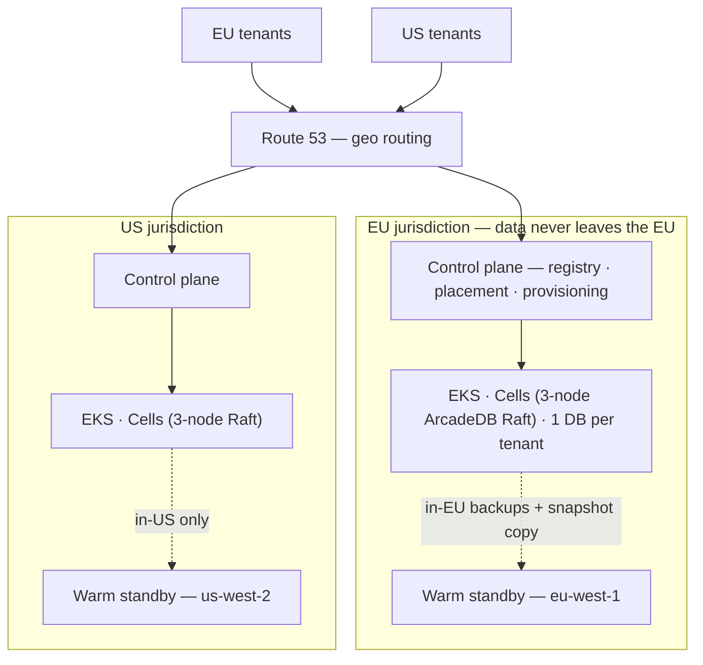

# ArcadeDB on AWS — Multi-Tenant Knowledge Base Platform

[](LICENSE)
[-orange.svg)](#status--roadmap)


> **Status: CTO approval package (Phase D).** This repository contains the
> **High-Level Design**, **basic boilerplate IaC templates**, and the **Claude
> Code day-one handover kit** that ship to the CTO for sign-off **before any AWS
> spend**. Nothing here is applied to AWS. Account IDs and other sensitive values
> are placeholders.
>
> **Start here:** the **[2-page design overview](docs/design-overview.md)** for the
> whole project at a glance, then the full **[High-Level Design](docs/architecture.md)**
> for depth.

A production-grade home on AWS for **[ArcadeDB](https://arcadedb.com)**, serving as
the data-layer foundation of a multi-tenant Knowledge Base for an AI SaaS. One
virtual database per tenant; two jurisdictions (EU + US) with hard GDPR residency;
built and operated **with Claude Code** for a clean hand-over to a cloud-ops team.

---

## Context — the problem we're solving

- **Multi-tenant SaaS KB.** Each tenant gets **one virtual database** on ArcadeDB
  (ArcadeDB natively hosts many DBs per server — a clean fit for "one DB per tenant").
- **Two jurisdictions from day one — EU + US** — with **hard GDPR residency**: EU
  tenant data and backups never leave the EU, and DR stays in-jurisdiction.
- **Designed to scale.** Start with one cell per geo; the control plane shards into
  more cells later **without rework**.
- **Clean day-one hand-over.** Everything reproducible, observable, documented, and
  guard-railed so a cloud-ops team can run it without us.
- **Built + operated with AI (Claude Code).** A `CLAUDE.md` hierarchy, custom skills,
  and deterministic hooks — and that AI operating model is itself a hand-over deliverable.

This package exists so the CTO can approve the **direction and the spend** on concrete
evidence — design + reasoning + templates + the AI kit — *before* we build.

## Why ArcadeDB (and what it forces on the design)

These verified facts are why this is **not** a generic "run a database on Kubernetes"
plan — each one drives a concrete design choice:

| ArcadeDB fact | Design consequence |
|---|---|
| HA is **leader-based Raft, GA from v26.4.1, min 3 nodes**; replication is per-DB | Every prod cell is a **3-node StatefulSet** with a PodDisruptionBudget; reads fan to replicas, writes go to the leader |
| **No per-database resource quotas** | The **control plane caps cell capacity**; the retrieval proxy enforces **per-tenant limits + a kill-switch** |
| **Critical cross-DB isolation CVE (CVSS 9.0), fixed in ≥ 26.4.1** | **Pin ≥ 26.4.1**; re-audit isolation after every upgrade; dedicated cells for sensitive tenants |
| **No native encryption, audit, or PITR; root password is set-once** | Encrypt at the **AWS/KMS** layer; build an **app-layer audit trail**; special root-rotation procedure |
| Backup is **hot per-DB ZIP** (no incremental/PITR/S3 target); **restore needs the target DB to not exist** | Layered backups (ZIP + EBS snapshots), warm-standby DR, a careful restore runbook |
| **Official Helm chart, but no Operator** | We own **day-2 upgrades** (quorum-aware, canary-first) |
| **Apache 2.0**, native **HNSW vectors + Lucene full-text** | No licence cost; KB = graph + docs + vectors in one engine (GraphRAG), behind a swappable interface |

## Architecture at a glance



- **Cell model.** A *cell* = one **3-node ArcadeDB Raft cluster** in its own namespace,
  with its own storage, load balancer, and backup prefix — the unit of **capacity, blast
  radius, and tenant placement**. We **scale by adding cells** (additive + zero-downtime),
  not by enlarging a cluster.
- **Tiered tenancy.** Standard tenants share **pooled cells** (cost-efficient); enterprise/
  regulated tenants get **dedicated cells** (the boundary we trust for sensitive data).
- **Control plane.** A regional registry (DynamoDB — never a global table) + placement/router
  + an idempotent provisioning state machine, all residency-aware and audited.
- **Residency in depth.** SCP region-deny + geo-pinned replication + registry geo-assertion
  + a CI policy gate + per-geo Terraform state — five layers.

## What's in this package

| Part | Where | What |
|---|---|---|
| **1. High-Level Design** | [`docs/architecture.md`](docs/architecture.md), [`docs/adr/`](docs/adr/), [`docs/assumptions.md`](docs/assumptions.md) | End-to-end solution, all architecture diagrams, one ADR per decision (context · options · decision · reasoning · consequences), and the living assumptions log. The 2-page summary is [`docs/design-overview.md`](docs/design-overview.md). |
| **2. Boilerplate IaC** | [`terraform/`](terraform/), [`helm/`](helm/), [`control-plane/`](control-plane/), [`.github/workflows/`](.github/workflows/) | Parameterised, instantiable Terraform/OpenTofu modules (network · eks · cell · backup-dr · observability) + landing zone, example `tfvars` per geo/env, a documented Helm `values.yaml`, control-plane interface stubs, and CI policy-gate workflows. |
| **3. Claude handover kit** | [`CLAUDE.md`](CLAUDE.md), [`.claude/`](.claude/), [`docs/runbooks/claude-code-operations.md`](docs/runbooks/claude-code-operations.md) | Root + nested `CLAUDE.md`, guard-rail hooks in `.claude/settings.json`, a self-contained `SKILL.md` per runbook, and the "operating this platform with Claude Code" guide. |

## The seven prime directives (never violated — see [`CLAUDE.md`](CLAUDE.md))

1. **Residency** — EU tenant data and backups stay in EU regions; DR pairs stay in-jurisdiction; no EU↔US data path exists.
2. **Version floor** — ArcadeDB **≥ 26.4.1** (closes the cross-DB isolation CVE + Raft HA); re-audit isolation after every upgrade.
3. **Quorum** — every prod cell runs **3 nodes**, one per AZ, with a PodDisruptionBudget `minAvailable: 2`.
4. **No public database** — ArcadeDB ports are never on a public subnet or public load balancer.
5. **Encrypt everything** at the platform layer (EBS/S3/Secrets/snapshots via KMS) — the engine provides none.
6. **No click-ops** — every resource is Terraform/Helm/GitOps; reproducible from a clean state.
7. **Sizing rule** — pod memory limit ≥ `maxPageRAM` + JVM heap + overhead, or the kernel OOM-kills a node and risks quorum.

## Key decisions (full reasoning in the [ADRs](docs/adr/))

| Decision | Choice | ADR |
|---|---|---|
| Compute platform | EKS + official ArcadeDB Helm chart | [0001](docs/adr/0001-compute-platform-eks.md) |
| IaC | Terraform / OpenTofu, greenfield | [0002](docs/adr/0002-iac-terraform-opentofu.md) |
| Tenancy isolation | Tiered (pooled + dedicated) | [0003](docs/adr/0003-tenancy-isolation-tiered.md) |
| Cell backing | Namespace-per-cell (cluster for enterprise) | [0004](docs/adr/0004-cell-backing-namespace.md) |
| Residency enforcement | Per-geo OU + SCP deny (defence in depth) | [0007](docs/adr/0007-residency-enforcement-scp.md) |
| Tenant registry | Regional DynamoDB (never global) | [0008](docs/adr/0008-tenant-registry-dynamodb.md) |
| Node compute | Graviton / arm64 (`r7g`) | [0009](docs/adr/0009-node-compute-graviton.md) |
| Version floor | ArcadeDB ≥ 26.4.1, digest-pinned | [0012](docs/adr/0012-version-floor-26-4-1.md) |
| DR strategy | Warm standby, in-jurisdiction | [0014](docs/adr/0014-dr-strategy-warm-standby.md) |
| KB retrieval | Native GraphRAG + escape hatch | [0024](docs/adr/0024-kb-retrieval-native-graphrag.md) |
| Scope boundary | Data-layer platform + seams | [0025](docs/adr/0025-scope-data-layer-platform.md) |

Full index: [29 ADRs](docs/architecture.md#9-decision-record-index-reasoning-lives-in-the-adrs).

## Built & operated with Claude Code

The [`.claude/`](.claude/) directory **ships in the repo and is owned by the cloud-ops
team** — so they operate the platform with the same AI assistance and guard-rails it was
built with:

- A **`CLAUDE.md` hierarchy** (root + per-area) encoding the prime directives + conventions.
- **Deterministic guard-rail hooks** ([`.claude/settings.json`](.claude/settings.json)) that
  block the dangerous mistakes — image `< 26.4.1`, a public DB port, prod `replicas < 3`,
  an out-of-geo region, a secret in a diff — regardless of who is at the keyboard.
- **16 self-contained skills** ([`.claude/skills/`](.claude/skills/)), one per runbook
  (provision, add-cell, upgrade, restore, DR drill, …).
- The ops guide: [`docs/runbooks/claude-code-operations.md`](docs/runbooks/claude-code-operations.md).

## Cost snapshot (order-of-magnitude, on-demand, pre-Savings-Plans)

- **Day-one footprint** (1 pooled cell + 2–3 enterprise cells per geo, both geos):
  **≈ $8.5–12k / month**.
- **Levers:** Graviton + Compute Savings Plans (−30–50% on compute), VPC endpoints (cut NAT),
  right-size the page cache, single-node non-prod cells. Details in [`docs/architecture.md` §10](docs/architecture.md#10-cost-order-of-magnitude-on-demand-pre-savings-plans).

## Repository layout

```
arcadedb/
├── CLAUDE.md                     # root project memory + prime directives
├── .claude/                      # settings.json hooks + skills (the AI operating model)
├── terraform/
│   ├── landing-zone/             # Org/OUs, SCPs (residency deny), IAM IC, KMS, state
│   ├── modules/{network,eks,cell,backup-dr,observability}/
│   └── environments/{eu,us}-{dev,stage,prod}/   # example tfvars per geo/env
├── helm/arcadedb/values.yaml     # pinned image, replicas=3, sizing, probes, MIME workaround
├── control-plane/                # registry schema, Step Functions ASL, router (interface stubs)
├── policy/conftest/              # OPA/Rego residency + "no public DB" gates
├── docs/                         # design-overview.md, architecture.md (HLD), adr/, assumptions.md, runbooks/
└── .github/workflows/            # CI policy gates (tfsec, checkov, trivy, conftest, kubeconform, cosign)
```

## How to read this repo

1. **[`docs/design-overview.md`](docs/design-overview.md)** — the 2-page summary (start here).
2. **[`docs/architecture.md`](docs/architecture.md)** — the full High-Level Design + diagrams.
3. **[`docs/adr/`](docs/adr/)** + **[`docs/assumptions.md`](docs/assumptions.md)** — the reasoning + assumptions.
4. **[`terraform/`](terraform/)** + **[`helm/arcadedb/`](helm/arcadedb/)** — the boilerplate IaC (start at each `README.md`).
5. **[`.claude/`](.claude/)** + **[`docs/runbooks/claude-code-operations.md`](docs/runbooks/claude-code-operations.md)** — the AI operating model + ops guide.

## Validating this package locally (no AWS, no credentials)

```bash
make validate     # fmt + init -backend=false + validate + tflint + conftest + helm lint + kubeconform
```

Individual targets are documented in the [`Makefile`](Makefile). **None of these
commands touch AWS.** `terraform`/`tofu` run with `-backend=false` and never
`plan`/`apply` against a real account.

## Status & roadmap

- **Now — Phase D (this package):** HLD + reasoning + boilerplate IaC + the Claude kit,
  for CTO sign-off. Locally validated; **nothing applied to AWS**.
- **After sign-off — Phases 0–4:** author the **Low-Level Design** (`docs/lld.md`), then build
  the landing zone → single-cell HA → control plane + tenant lifecycle → multi-region + DR →
  observability/SLO/handover hardening. See [`docs/architecture.md` §11](docs/architecture.md#11-rollout-phases-deliverables--exit-criteria).

> **How this started:** the original four-line problem statement and the first raw plan
> are preserved in [`docs/design-process/`](docs/design-process/) — the path from a blank
> page to this package.

## Contributing & security

Questions, feedback, and critiques of the design are welcome — see
[`CONTRIBUTING.md`](CONTRIBUTING.md) and [`SECURITY.md`](SECURITY.md).

## License

Licensed under the **Apache License 2.0** — see [`LICENSE`](LICENSE). ArcadeDB itself is
Apache 2.0, so the whole stack stays permissively licensed.
