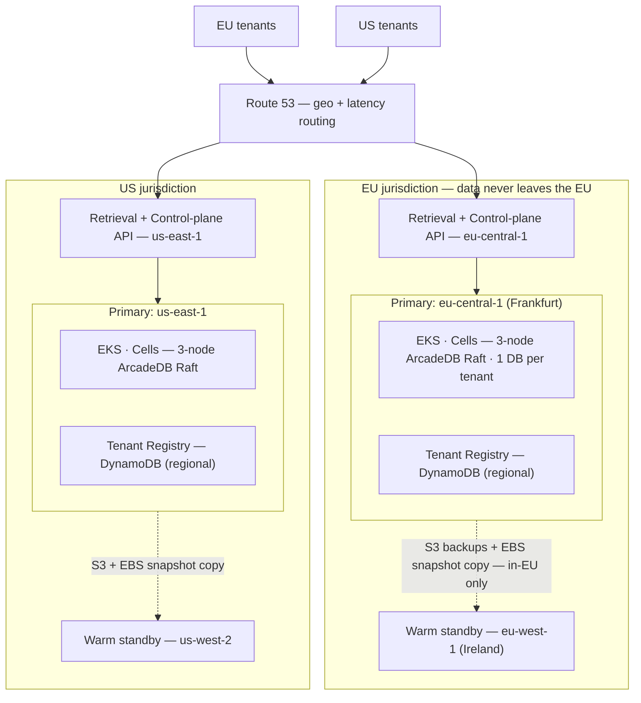
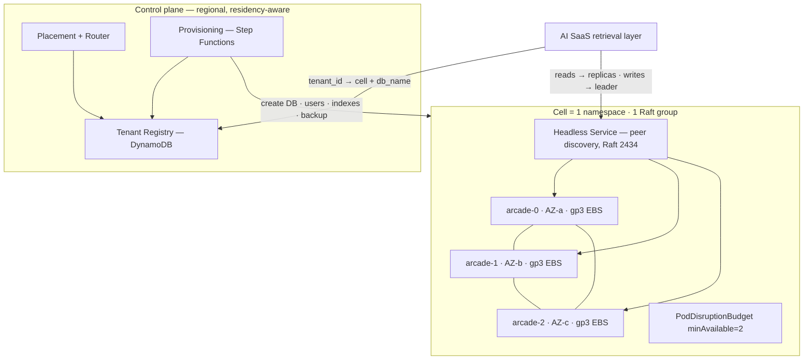
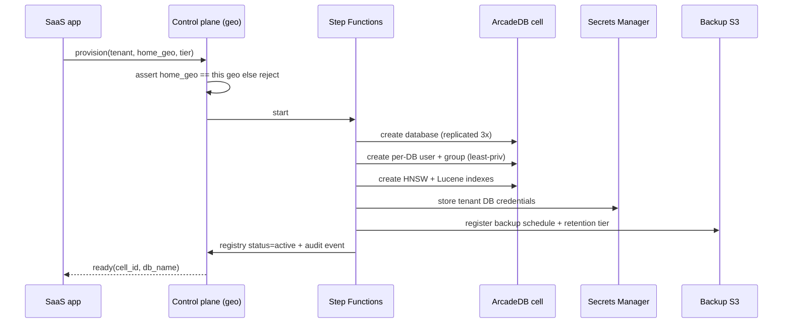
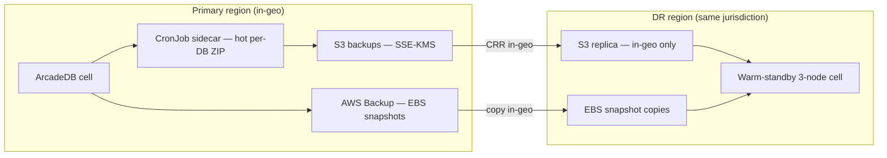

# High-Level Design — ArcadeDB on AWS, Multi-Tenant Knowledge Base Platform

> **Document type:** High-Level Design (HLD) — part 1 of the CTO approval package (Phase D).
> **Status:** Draft for CTO sign-off. **Nothing is built or applied to AWS.**
> **Audience:** CTO (approval + spend), platform engineers (build), cloud-ops team (run).
> **Companion docs:** [`design-overview.md`](design-overview.md) (the 2-page exec summary — start there) · [`assumptions.md`](assumptions.md) (living assumptions log) · [`adr/`](adr/) (one ADR per decision with full reasoning) · `lld.md` (Low-Level Design — authored *after* approval).
> **Source of truth for decisions:** the [ADR index](#9-decision-record-index-reasoning-lives-in-the-adrs). Where this doc says "see ADR-NNNN", that ADR holds the options, trade-offs, and the *why*.

---

## 1. Executive summary

We are building a **production-grade home on AWS for [ArcadeDB](https://arcadedb.com)**, the data-layer foundation of a **multi-tenant Knowledge Base (KB) for our AI SaaS**. The design is shaped by hard facts about ArcadeDB (see §2) and by a small set of decisions the business has already made (see §3).

**The shape of the problem:**

- **Multi-tenant**, one **virtual database per tenant** (ArcadeDB natively hosts many DBs per server — a clean fit).
- **Two jurisdictions from day one — EU and US** — with **GDPR residency** as a hard, defence-in-depth invariant: EU tenant data and backups never leave the EU.
- **Built for a clean hand-over** to a cloud-ops team: reproducible, observable, documented, guard-railed.
- **Built and operated with Claude Code** — a `CLAUDE.md` hierarchy, custom skills, and deterministic hooks — and that AI operating model is itself a hand-over deliverable the ops team owns.

**What we are asking the CTO to approve:** the *direction* and the *spend*, on the strength of this HLD + reasoning (ADRs) + assumptions + **basic boilerplate IaC templates** + the Claude hand-over kit. On sign-off we author the Low-Level Design and execute the build (Phases 0–4, §11). **No AWS resources are created until then.**

**Headline cost (order-of-magnitude, on-demand, pre-Savings-Plans):** the agreed day-one footprint (one pooled cell + 2–3 enterprise dedicated cells, per geo, both geos) is **≈ $8.5–12k/month**, with Compute Savings Plans expected to cut the dominant compute line 30–50 %. See §10.

**The single most load-bearing assumption** is per-tenant data size (standard 1–20 GB, enterprise ≤ ~500 GB). It sets the cell capacity caps and node sizing. If the real distribution differs, the caps and node sizes re-derive — see [`assumptions.md`](assumptions.md) A2.

---

## 2. What we verified about ArcadeDB (the load-bearing facts)

These facts — confirmed against the official docs / GitHub — **drive the entire design**. They are why this is *not* a generic "run a database on Kubernetes" plan.

| # | Fact | Source | Design consequence |
|---|---|---|---|
| F1 | HA is **leader-based Raft (Apache Ratis)**, GA from **v26.4.1**; **min 3 nodes** for majority quorum; replicas serve reads; replication is **per-database**. | [HA docs](https://docs.arcadedb.com/arcadedb/how-to/operations/ha) | Every prod cell is a **3-node StatefulSet**; a PodDisruptionBudget protects quorum; reads can fan out to replicas. |
| F2 | **No per-database resource quotas** — noisy-neighbour is unmitigated at the engine. | [settings](https://docs.arcadedb.com/arcadedb/reference/settings) | The **control plane** enforces **cell capacity caps**; the **retrieval/proxy layer** enforces per-tenant runtime governance; big tenants get isolated cells. |
| F3 | **Critical cross-DB isolation CVE (CVSS 9.0)**, fixed in **≥ 26.4.1**. | [GHSA-fxc7-fm93-6q77](https://github.com/ArcadeData/arcadedb/security/advisories/GHSA-fxc7-fm93-6q77) | **Pin ≥ 26.4.1**; re-audit cross-DB isolation after every upgrade; the trusted boundary for sensitive tenants is a **dedicated cell**; a **continuous isolation probe** runs in prod. |
| F4 | **No native encryption-at-rest, no native audit log**; root password is **set-once**. | [users docs](https://docs.arcadedb.com/arcadedb/how-to/operations/users) | Encrypt at the **EBS/S3/KMS** layer; build an **app-layer DB-access audit trail**; special root-rotation procedure (provision a *new* admin user, never re-set the init var). |
| F5 | Backup is **online/hot, per-DB, ZIP, excludes WAL**; **no incremental, no PITR, no native S3 target**; restore requires the **target DB to not exist**. | [backup docs](https://docs.arcadedb.com/arcadedb/how-to/operations/backup) | RPO is bounded by backup cadence; supplement with **EBS snapshots**; **warm-standby** DR; the restore runbook must drop/rename first and rebuild indexes. |
| F6 | **Official Helm chart (StatefulSet), no Operator**; `/ready` health (HTTP 204, no auth); Prometheus at `/prometheus` with a known **MIME-type bug**. | [k8s docs](https://docs.arcadedb.com/arcadedb/how-to/operations/kubernetes) · [helm](https://github.com/ArcadeData/arcadedb-helm) | We own day-2 logic (upgrades) ourselves; `/ready` for probes; ship a MIME-fix workaround for scraping. |
| F7 | **Apache 2.0**, fully open source; native **HNSW vector** + **Lucene full-text** (GraphRAG). | [vector tutorial](https://docs.arcadedb.com/arcadedb/tutorials/vector-search-tutorial) | No licence cost; KB can be **graph + documents + vectors in one engine**, behind a swappable retrieval interface. |

**ArcadeDB scaling model & ceilings** (know these before capacity planning):

- **Single-leader write ceiling per cell** — all writes funnel through the Raft leader; scale writes by **spreading tenants across more cells**, not by enlarging a Raft group.
- **No intra-cell sharding of a single DB** — every node holds a full replica of every DB; a single tenant DB is bounded by **one node's disk/RAM**.
- **Scaling unit = node size + number of cells** — grow vertically up to a point, then **shard tenants into more cells**.
- **Read scaling couples to storage** — extra replicas scale reads but each stores the full cell (read capacity and storage cost rise together).
- **Tenant moves incur near-downtime** — no live per-DB migration; moving a tenant is hot-backup → restore → cut over (a scheduled, brief write-freeze).

---

## 3. Decisions already made (the spine of this design)

| Question | Decision | Captured in |
|---|---|---|
| Scale | **Design to scale** — start with one cell, build the control plane to shard into cells later without rework. | ADR-0003, ADR-0004 |
| Isolation | **Tiered** — pooled cells for standard tenants, **dedicated cells** for enterprise/regulated. | ADR-0003 |
| Compute | **EKS / Kubernetes**, official ArcadeDB Helm chart, StatefulSets. | ADR-0001 |
| IaC | **Terraform / OpenTofu, greenfield.** | ADR-0002 |
| KB / vectors | **Recommend** — ArcadeDB-native GraphRAG behind a `RetrievalProvider` interface, with a documented escape hatch. | ADR-0024 |
| Availability / DR | **Multi-AZ + cross-region DR** — 3 AZs per cell + warm-standby DR region. | ADR-0014 |
| Regions / residency | **EU + US** — region is a cell-placement dimension; DR stays in-jurisdiction. | ADR-0006, ADR-0007 |
| Ops tooling | **AWS-native + Prometheus/Grafana + Secrets Manager** (AMP + AMG, CloudWatch Logs via Fluent Bit, Secrets Manager + External Secrets). | ADR-0017, ADR-0018 |

**Recommended scope (overridable):** this is a **data-layer platform** (cleanest hand-over — ops run a *data platform*, not the AI application), exposing well-defined seams. The AI-SaaS app runs in a **separate AWS account** and reaches the platform over **in-geo AWS PrivateLink**. See §8 and ADR-0025/ADR-0026.

---

## 4. Prime directives (the invariants we never violate)

These are encoded in [`CLAUDE.md`](../CLAUDE.md), enforced by `.claude/` hooks, and gated in CI:

1. **Residency** — EU tenant data and backups stay in EU regions. DR pairs stay in-jurisdiction. No EU↔US data path exists.
2. **Version floor** — ArcadeDB **≥ 26.4.1**. Re-audit cross-DB isolation after every upgrade.
3. **Quorum** — every prod cell runs **3 nodes**, one per AZ, PDB `minAvailable: 2`. Never drop below quorum during drains/upgrades. *(Non-prod cells may run single-node to save cost — ADR-0003 / §11 Phase 1.)*
4. **No public database** — ArcadeDB ports are never on a public subnet or public load balancer.
5. **Encrypt everything** at the platform layer (EBS/S3/Secrets/snapshots via KMS) — the engine provides none.
6. **No click-ops** — every resource is Terraform/Helm/GitOps; reproducible from a clean state.
7. **Sizing rule** — pod memory limit ≥ `maxPageRAM` + JVM heap + overhead, or the kernel OOM-kills a node and risks quorum.

---

## 5. End-to-end architecture

### 5.1 Multi-geo, residency-locked overview



The two jurisdictions are **fully independent stacks**. There is deliberately **no connectivity** between them — not even a management path that could carry data. Residency is enforced in depth (§7.1).

### 5.2 AWS landing zone (greenfield, Terraform) — geo is a hard boundary

We bootstrap with **AWS Control Tower + Account Factory for Terraform (AFT)** (ADR-0005) — the fastest SOC2-credible multi-account baseline (org CloudTrail, Config, Log Archive + Audit accounts) while keeping account vending GitOps-driven. Terraform then owns all workload infra.

```
Root
├── Security OU        → log-archive (immutable central logs) · audit (GuardDuty/SecurityHub delegated admin)
├── Infrastructure OU  → shared-services (ECR, Route 53, Terraform state, AMG, IPAM)
├── Workloads-EU OU    → eu-dev · eu-stage · eu-prod      ← residency boundary
└── Workloads-US OU    → us-dev · us-stage · us-prod      ← residency boundary
```

- **Regions:** EU primary **eu-central-1 (Frankfurt)** → DR **eu-west-1 (Ireland)**; US primary **us-east-1** → DR **us-west-2**. DR is **jurisdiction-locked** (ADR-0006).
- **Identity:** **IAM Identity Center (SSO)** federated to the IdP, permission sets per role, **no IAM users**; alarmed break-glass role per prod account; workloads use **EKS Pod Identity** (ADR-0011).
- **State:** S3 with **native state locking** (Terraform ≥ 1.10 / OpenTofu), SSE-KMS, versioned, **per-geo buckets** (EU state in EU) — ADR-0022.

### 5.3 Networking

One VPC per workload account per region, **3-AZ private subnets** for nodes and DB pods, **no public DB exposure**, IPAM-allocated non-overlapping CIDRs, and **VPC endpoints** (S3/ECR/STS/Secrets/Logs/KMS/AMP/…) to cut NAT cost and keep traffic private. There is **no cross-geo connectivity**; in-geo DR uses S3/EBS-snapshot copy (AWS-managed). VPC peering is reserved for the single in-geo primary↔DR pair if ever needed.

### 5.4 The cell model + control plane

**A cell** = *one 3-node ArcadeDB Raft cluster (one StatefulSet) in its own namespace, with its own EBS volumes, load balancer, backup prefix, and registry entry; belongs to exactly one geo + one environment; it is the unit of capacity, blast radius, and tenant placement.*

- **Cell backing (ADR-0004):** standard/pooled cell = **a namespace in a shared regional EKS cluster** (one EKS control plane serves many cells → big cost saving; the data blast radius is already bounded by the per-cell Raft group). Enterprise/regulated dedicated cell = optionally a **dedicated EKS cluster**. The cell module exposes `cell_isolation = "namespace" | "cluster"`.



**Control-plane components:**

- **Tenant Registry** — **regional DynamoDB** (ADR-0008), PITR on, DR-replicated **within the geo only** (never a global EU↔US table). Keys: `tenant_id`, `home_geo`, `tier`, `cell_id`, `db_name`, `status`, `size_bytes_last`, `backup_policy`, `secret_arn_pointer`, `consistency_level`, `schema_version`.
- **Placement + Router** — picks a cell by `geo + env + tier + has_capacity` (least-loaded); the retrieval layer resolves `tenant_id → cell + db_name` (cached). Two ArcadeDB-specific routing rules: **writes go to the Raft leader** (validate leader-forwarding on the pinned version, A5); **reads fan out to replicas** with `read_your_writes` (or `eventual`) consistency to offload the leader.
- **Cell capacity model** (because there are no per-DB quotas) — a pooled cell is "full" when **any** cap trips: **~150 standard DBs**, or **~60 % of `maxPageRAM` committed** to working sets, or **~70 % disk**. Big tenants (projected > ~50 GB or write/index-heavy) are **never** placed in a pooled cell. *(Starting heuristics tied to the data-size assumption A2 — tune from metrics.)*
- **Provisioning** — an idempotent **Step Functions** state machine (retryable, auditable):



- **Adding a cell is purely additive** — a new namespace/StatefulSet/PVCs/LB/backup prefix forms its own Raft group → registers as available → the router places *new* tenants there. **Zero downtime; no existing tenant or Raft group is touched.** Moving an existing hot tenant is a separate explicit migration runbook.

**Day-one footprint (agreed worked example, A3):** launch = **50 standard + 2–3 enterprise tenants per geo**. Per geo: **one pooled cell** (50 of the ~150-DB cap ≈ ⅓ full → wide headroom) **plus 2–3 dedicated enterprise cells** (one tenant each). The same cell module + control plane scale this to thousands by adding cells — no redesign.

### 5.5 EKS + ArcadeDB runtime specifics

- **Nodes:** **Graviton / arm64** (`r7g` family for DB nodes — best price-performance for a RAM/throughput-bound JVM; verify the arm64 image digest in CI) — ADR-0009. **Managed node groups, one per AZ, for the stateful DB tier** (predictable, AZ-pinned — *do not* let Karpenter consolidate a node out from under a DB pod and bounce quorum); **Karpenter for stateless** (app, controllers, jobs); a small system node group for add-ons — ADR-0010.
- **AZ pinning:** EBS is AZ-bound → `StorageClass` gp3, `volumeBindingMode: WaitForFirstConsumer`, encrypted with the geo KMS key, `allowVolumeExpansion: true`. On full-AZ loss, the other 2 nodes hold quorum; **do not** auto-recreate the lost pod with an empty volume in another AZ (that forces full re-replication) — handle in the failover runbook.
- **Memory sizing (the #1 gotcha):** give RAM to the **off-heap page cache** (`maxPageRAM`), keep heap modest. Pod memory **limit ≥ heap + maxPageRAM + JVM/OS overhead**. *Worked example:* `r7g.2xlarge` (64 GiB) → `maxPageRAM=32g`, `-Xmx=8g`, pod limit ~46–48 GiB. **Avoid a tight CPU limit** — throttling starves Raft heartbeats → leader flapping.
- **Durability (ADR-0013):** `txWalFlush` default `0` = no fsync per commit. Set **`txWalFlush=2` (fsync)** for strict-durability tenants (enterprise/regulated); standard tenants may run `0`/`1` for throughput. Per-tier, not default-and-forget.
- **Ingress & app connectivity:** ArcadeDB's own ports never leave the cluster. The platform's **retrieval + provisioning API** is fronted by an **internal NLB → VPC endpoint service (PrivateLink)**, consumed by the separate app account in the same geo; TLS via ACM. In-cluster east-west uses the ClusterIP/headless Service (HTTP 2480, Bolt 7687). Probes → `/ready` (204) with a generous startup probe.
- **Client resilience on failover:** a leader election creates a brief write-unavailability window. The DB client must **retry with backoff, re-discover the leader**, make writes **idempotent where possible**, and keep reads on replicas. Target: writes resume within the election timeout + a few seconds — tested in Phase 1.
- **Upgrades (no operator → we own it, ADR-0029):** quorum-aware rolling upgrade — pre-flight health + fresh backup, **upgrade replicas first one-at-a-time** (wait for re-join + lag→0 + `/ready`), **leader last** (graceful step-down), confirm mixed-version Raft compatibility, **re-audit cross-DB isolation** after. Roll out canary cell → one prod cell → fleet. **Rollback caveat (critical):** upgrades are effectively **forward-only** — no PITR, and an on-disk format change can make a downgrade impossible, so the only true rollback is **restore-from-backup to the prior version**.

---

## 6. Knowledge Base / retrieval

**Start ArcadeDB-native** (ADR-0024) — graph + documents + **HNSW vectors** + **Lucene full-text**, composed into **GraphRAG** (vector recall → graph traversal for context expansion → full-text rerank) — **behind a `RetrievalProvider` interface**.

- *Why:* one engine, one backup/residency/HA story, and true GraphRAG (graph + vector co-located) is the differentiator.
- *Risks (flagged):* HNSW maturity; **vector-index RAM competes with the page cache** (count vector RAM in the capacity model); recall quality.
- **Escape hatch:** because retrieval is behind an interface, externalise **vectors only** to **OpenSearch Serverless (vector)** or **Aurora pgvector** (in-geo) by flipping a provider config — no app rewrite.
- **Decision gate:** a Phase-2 recall/latency/RAM benchmark on real KB data; if native fails it, take the escape hatch before GA.
- **Scope:** the platform exposes the write/index + bulk-load APIs and the `RetrievalProvider`; the **ingestion/embedding pipeline, chunking, embedding-model choice (e.g. Bedrock), and re-embedding/backfill are app-owned** — and that re-ingestable source is exactly the sub-hour-RPO escape hatch (§7.4).

---

## 7. Cross-cutting concerns

### 7.1 Security & compliance (SOC2-ready + GDPR residency)

- **KMS:** per-geo, per-account CMKs (separate keys for EBS, S3, Secrets, AMP, snapshots), rotation on; **per-tenant CMK option** for enterprise cells (crypto-shred on offboarding).
- **Encryption everywhere** (the only at-rest encryption ArcadeDB gets): EBS/S3/Secrets/snapshots SSE-KMS; TLS at ALB/NLB; east-west starts NetworkPolicy + private-subnet, **add mTLS for enterprise/regulated cells** (ADR-0019).
- **Network isolation:** private subnets only for data; least-privilege security groups (DB ports only from the cluster SG); **default-deny Kubernetes NetworkPolicies** per cell namespace; CNI **Cilium** for L7/identity-aware policy (ADR-0023).
- **Secrets:** **Secrets Manager + External Secrets Operator** via Pod Identity (ADR-0018). **Root password is set-once** → generate before first boot, inject via env, mark immutable; "rotating root" means provisioning a *new* admin server-user. **Per-tenant DB credentials are normal, rotatable secrets.**
- **Audit (no native DB audit → 3 layers):** (1) AWS-plane — org CloudTrail, Config, VPC Flow Logs, ALB/NLB access logs, EKS audit logs → immutable log-archive S3; (2) **app-layer DB-access audit** — the retrieval/data service emits a structured event (tenant, principal, db, op, ts) for every privileged/tenant data op (the SOC2 substitute for engine audit); (3) HTTP access logs. **GuardDuty (EKS Runtime) + Security Hub** org-wide, delegated to the audit account.
- **Supply chain:** **ECR per region, scan-on-push** (Inspector), **Trivy** CI gate, **cosign** signing + Kyverno/Gatekeeper admission rejecting unsigned/critical-CVE images; mirror the pinned ArcadeDB image into ECR.
- **Residency enforced in depth:** (1) **SCP** on `Workloads-EU` denies any action where `aws:RequestedRegion` ∉ EU allow-list (+ a small global-service allowlist); (2) S3 replication destinations are geo-pinned in Terraform with a validation guard; (3) the registry stores `home_geo` and the router refuses cross-geo placement; (4) a **Conftest/OPA CI gate** fails any resource with an out-of-geo region literal; (5) even Terraform state buckets are per-geo. *(Defence in depth — ADR-0007.)*
- **GDPR data-subject primitives:** per-tenant **DB drop**, per-tenant **KMS crypto-shred** (enterprise), targeted **record purge**, and **deletion evidence** (audit event + certificate). One-DB-per-tenant makes whole-tenant erasure clean. The app owns the *workflow* and legal process.

### 7.2 Runtime tenant governance (real-time noisy-neighbour control)

Capacity caps bound *placement*; they do **not** stop one tenant's runaway query from saturating a pooled cell live (no per-DB quotas, F2). The **retrieval/proxy layer therefore enforces, per tenant** (ADR-0027): query timeouts + result/row caps; rate limits (QPS + heavy-op budget) with fair-share scheduling; a **cost guard / circuit breaker** that sheds or isolates a degrading tenant, plus a **manual kill-switch**; and a **continuous cross-tenant isolation probe** that attempts cross-DB access on every cell and **alerts if it ever succeeds** (given the CVE history, F3). Enterprise tenants sidestep most of this by being alone in a dedicated cell.

### 7.3 Schema & migration management across tenant DBs

One DB per tenant makes schema evolution a **fan-out** problem the platform owns (ADR-0028): **versioned migrations** (`schema_version` per DB) applied by an idempotent **migration runner** (Step Functions / Argo Workflow), **batched + rate-limited**; **online, additive-first** changes with HNSW/Lucene index builds backgrounded; **canary + staged rollout** (one tenant → one cell → fleet) with **per-tenant rollback** and a **dry-run/plan**. Exposed to the app via a **migration API/CLI + schema registry** (the §8 seam), surfaced as the `migrate-schema` skill.

### 7.4 Backup, DR & business continuity



- **Layered backups (ADR-0015/0016):** (A) **hot per-DB ZIP via a CronJob sidecar** that calls the backup API → verifies → uploads to S3 (no native S3 target) → records status in the registry. Cadence: standard **6 h**, enterprise **1 h**; tiered retention; layout `s3://kb-backups-<geo>-<env>/cell/<cell>/<tenant>/<ts>.zip`, **CRR in-geo only**, Object Lock for enterprise. (B) **AWS Backup EBS snapshots** every 4–6 h (captures WAL/on-disk state the ZIP omits), KMS-encrypted, copied to the in-geo DR region.
- **Restore runbook bakes in the gotcha (F5):** the target DB **must not exist** → drop/rename first, then restore the ZIP, **rebuild HNSW/Lucene indexes** + per-DB users, re-register backup, smoke-test, audit. Whole-cell recovery prefers EBS-snapshot restore over restoring 150 ZIPs.
- **DR = warm standby per geo, in-jurisdiction (ADR-0014):** a minimal running 3-node cluster in the DR region fed by in-geo S3 + snapshot copies; failover = scale up + promote + repoint the (already in-geo DR-replicated) registry + flip Route 53. *Not pilot-light* (restore + index rebuild too slow for RTO); *not active-active* (Raft is single-leader, no built-in cross-region replication).
- **RPO/RTO (honest):** standard **RPO ≤ 6 h / RTO ≤ 4 h**; enterprise **RPO ≤ 1 h / RTO ≤ 1–2 h**. *No PITR means near-zero RPO is impossible with native tooling* — the escape hatch is keeping the **ingest source re-ingestable**. **DR game-day quarterly per geo; restore-a-random-tenant monthly.**

### 7.5 Observability & SLOs

- **Metrics:** ADOT/Prometheus agent scrapes ArcadeDB `/prometheus` + JVM + node + kube-state → **Amazon Managed Prometheus**; **Amazon Managed Grafana** dashboards/alerts (ADR-0017). **Handle the `/prometheus` MIME-type bug** (returns `application/json`): force the text parser in the scrape config, or run a tiny header-rewriting sidecar — baked into Helm values.
- **Alert on:** quorum lost (<2/3 → page immediately), leader flapping, replication lag, page-cache eviction/hit-ratio, JVM GC/heap, **OOMKilled** pods, EBS %used >75/85 %, IOPS/throughput throttling, **backup failure / last-backup-age > SLA**, DR replication lag, TLS/cert expiry <30 d, ESO sync failures, **capacity caps crossed**, break-glass use.
- **Logs:** Fluent Bit → **CloudWatch Logs** (ArcadeDB `java.util.logging` to JSON/stdout), per-cell log groups, KMS-encrypted, exported to log-archive S3.
- **Per-tenant usage metering:** per-tenant metrics (query count/latency, storage bytes, vector ops, write volume) → AMP + a **metered-usage stream** the app/billing consumes (the §8 seam). Doubles as noisy-neighbour detection + capacity input.
- **Distributed tracing:** OpenTelemetry across app → PrivateLink → retrieval/control-plane → ArcadeDB so GraphRAG latency is attributable per hop and per tenant.
- **SLOs:** read-path availability **99.9 %/mo**, write-path **99.5 %**, retrieval read p95 **< 150 ms** in-cell, write p95 **< 500 ms** (higher with `txWalFlush=2`), RPO/RTO per §7.4. Error budget governs change freezes. Routing: Grafana/Alertmanager → SNS → PagerDuty (P1 quorum/region; P2 capacity/backup to Slack + ticket); CloudWatch Synthetics canaries per geo.

### 7.6 CI/CD & GitOps

- **CI:** GitHub Actions (build/test the retrieval + control-plane code, build + scan + sign images, mirror the pinned ArcadeDB image to ECR per region).
- **Terraform runner:** **Spacelift** (stack dependencies, drift detection, OPA policy gates, **mandatory manual approval on prod / any geo-prod apply**) — ADR-0020; Atlantis is the budget alternative.
- **GitOps:** **Argo CD** app-of-apps, **per-cell ApplicationSets** (adding a cell = adding a generator entry) — ADR-0021.
- **Promotion:** dev → stage → prod folders × an eu/us geo overlay. Promote **config/infra only, never data**.
- **Policy gates (block merge/apply):** tfsec + checkov (Terraform), Trivy (images/IaC/SBOM), **Conftest/OPA** incl. the **residency region-allowlist check** and "no public DB SG", kubeconform/Kyverno (signed-image admission). **Residency is a hard CI gate, not just an SCP.**

---

## 8. Scope boundary — platform vs the AI-SaaS app

This is a **data-layer platform**. It exposes seams so the app team is never blocked:

| This platform owns | Seam it exposes | The AI-SaaS app owns |
|---|---|---|
| ArcadeDB clusters/cells, control plane, tenant lifecycle | Provisioning + retrieval API (private) | Ingestion/embedding pipeline; KB ontology / graph-schema *definition* |
| **Schema-migration tooling** (versioned, fan-out across tenant DBs) | Migration API/CLI + schema registry | *Which* schema/ontology to ship and when |
| Per-tenant **usage metering data** | Metered-usage stream / metrics | Billing, rating, showback, plan limits |
| Data-layer **erasure primitives** + deletion evidence | Erasure / DSAR API | The RTBF/DSAR *workflow* + legal process |
| Backups/DR, security, residency, observability | `/ready`, metrics, audit events | App-level SLOs, product features |

**App connectivity (ADR-0026):** the AI-SaaS app runs in a **separate AWS account** and reaches the platform's retrieval/provisioning API over **AWS PrivateLink** (in-geo only: EU app ↔ EU platform) — clean blast-radius, billing, and security separation, residency-preserving.

---

## 9. Decision record index (reasoning lives in the ADRs)

Status legend: ✅ decided by the business · ⭐ recommended (overridable). Each row links to its full ADR (Context · Assumptions · Options + pros/cons · Decision · Reasoning · Consequences · Status · Review-trigger).

| ADR | Decision | Choice | Main alternative |
|---|---|---|---|
| [0001](adr/0001-compute-platform-eks.md) | Compute platform | ✅ EKS | ECS / EC2 |
| [0002](adr/0002-iac-terraform-opentofu.md) | IaC tool | ✅ Terraform/OpenTofu greenfield | CDK / CloudFormation |
| [0003](adr/0003-tenancy-isolation-tiered.md) | Tenancy isolation | ✅ Tiered (pooled + dedicated) | Pure pooled / pure siloed |
| [0004](adr/0004-cell-backing-namespace.md) | Cell backing | ⭐ Namespace-per-cell (cluster for enterprise) | One EKS per cell |
| [0005](adr/0005-landing-zone-control-tower-aft.md) | Landing zone | ⭐ Control Tower + AFT | Pure-Terraform LZ |
| [0006](adr/0006-regions-eu-us-pairs.md) | Regions | ⭐ euc1→euw1, use1→usw2 | Other EU/US pairs |
| [0007](adr/0007-residency-enforcement-scp.md) | Residency enforcement | ⭐ Per-geo OU + SCP deny (+ defence in depth) | App-layer only |
| [0008](adr/0008-tenant-registry-dynamodb.md) | Tenant registry | ⭐ Regional DynamoDB | Global table |
| [0009](adr/0009-node-compute-graviton.md) | Node compute | ⭐ Graviton arm64 | x86 |
| [0010](adr/0010-node-provisioning-mng-karpenter.md) | Node provisioning | ⭐ MNG (stateful) + Karpenter (stateless) | All-Karpenter |
| [0011](adr/0011-workload-identity-pod-identity.md) | Workload identity | ⭐ EKS Pod Identity | IRSA |
| [0012](adr/0012-version-floor-26-4-1.md) | Version floor | ⭐ ArcadeDB ≥ 26.4.1 | Older / latest-unpinned |
| [0013](adr/0013-durability-txwalflush-per-tier.md) | Durability | ⭐ `txWalFlush` per tier | Global default |
| [0014](adr/0014-dr-strategy-warm-standby.md) | DR strategy | ⭐ Warm standby | Pilot light / active-active |
| [0015](adr/0015-backup-cronjob-sidecar.md) | Backup mechanism | ⭐ CronJob sidecar → S3 | Auto-backup plugin |
| [0016](adr/0016-snapshot-aws-backup.md) | Snapshot orchestration | ⭐ AWS Backup | DLM |
| [0017](adr/0017-observability-amp-amg.md) | Observability | ✅ AMP + AMG + CloudWatch Logs | Datadog / self-managed |
| [0018](adr/0018-secrets-secrets-manager-eso.md) | Secrets | ✅ Secrets Manager + ESO | Vault / SSM |
| [0019](adr/0019-tls-mtls-tiered.md) | TLS/mTLS | ⭐ ALB-terminated + NetworkPolicy; mesh for enterprise | Native keystore everywhere |
| [0020](adr/0020-tf-runner-spacelift.md) | TF runner | ⭐ Spacelift | Atlantis / TFC |
| [0021](adr/0021-gitops-argocd.md) | GitOps | ⭐ Argo CD | Flux |
| [0022](adr/0022-state-locking-s3-native.md) | State locking | ⭐ S3 native | DynamoDB |
| [0023](adr/0023-cni-cilium.md) | CNI/NetworkPolicy | ⭐ Cilium | VPC CNI |
| [0024](adr/0024-kb-retrieval-native-graphrag.md) | KB retrieval | ⭐ ArcadeDB-native GraphRAG + escape hatch | External vector store |
| [0025](adr/0025-scope-data-layer-platform.md) | Scope boundary | ⭐ Data-layer platform + seams | Own ingestion / full-KB |
| [0026](adr/0026-app-connectivity-privatelink.md) | App connectivity | ⭐ Separate account + in-geo PrivateLink | Co-located in-cluster |
| [0027](adr/0027-runtime-tenant-governance.md) | Runtime tenant governance | ⭐ App-layer timeouts/limits/breaker + kill-switch | Placement caps only |
| [0028](adr/0028-schema-migration-fanout.md) | Schema migration | ⭐ Versioned fan-out runner (canary→fleet) | Ad-hoc per-DB scripts |
| [0029](adr/0029-upgrade-rollback-restore-based.md) | Upgrade rollback | ⭐ Canary + restore-based rollback | Forward-only, no rollback |

---

## 10. Cost (order-of-magnitude, on-demand, pre-Savings-Plans)

**Starter footprint per geo** (one 3-node pooled cell + landing zone + observability): ArcadeDB nodes 3×`r7g.2xlarge` ~$1.1–1.3k · EKS $73 · system/app nodes ~$200–300 · EBS ~$120–200 · snapshots + S3 ~$80–150 · NAT + endpoints ~$150–250 · AMP + AMG ~$150–300 · CloudWatch ~$80–150 · Secrets/KMS/Route53/ECR/LB/GuardDuty ~$200–350 → **~$2.4–3.3k/geo/mo**.

**Day-one total** (pooled cell + 2–3 enterprise dedicated cells per geo): an enterprise cell starts ~$550–700/mo (3×`r7g.xlarge`) + EBS/backup → **+~$1.8–2.7k/geo**. Combined day-one ≈ **~$4.2–6k/geo/mo**, **~$8.5–12k/mo both geos** before Savings Plans (−30–50 % on compute).

**Levers:** Graviton + Compute Savings Plans (the dominant node line), VPC endpoints (cut NAT), right-size `maxPageRAM`, **single-node non-prod cells** (−⅔ of non-prod DB cost). **Cost caveats often missed:** cross-AZ data transfer (Raft replication across 3 AZs) is a real recurring line item; vector indexes consume page-cache RAM; enterprise economics are dominated by the dedicated-cell cost → reflect it in the enterprise SKU. Cost basis = on-demand list price, both geos, pre-Savings-Plans (conservative upper bound, A10).

---

## 11. Rollout phases (deliverables + exit criteria)

- **Phase D — Design & boilerplate package (this CTO approval gate).** The HLD (this doc), the basic boilerplate IaC templates, and the Claude hand-over kit. *Exit:* **CTO signs off on direction + spend.** **No AWS resources are created.**
- **Phase 0 — Foundations / landing zone (post-approval).** Author the **LLD** (`docs/lld.md`); Control Tower + AFT; OUs + SCPs (incl. residency deny); IAM Identity Center; KMS; per-geo state; CloudTrail/Config/GuardDuty/SecurityHub; VPCs (3-AZ, endpoints); ECR; CI skeleton + policy gates. *Exit:* reproducible from clean state; **SCP provably blocks a non-EU region action in an EU account**; every decision has an ADR, every assumption a log entry.
- **Phase 1 — Single-cell EKS + ArcadeDB HA (one geo first).** Regional EKS; per-AZ stateful node groups + Karpenter; ArcadeDB Helm StatefulSet (3 nodes, anti-affinity, gp3-KMS PVCs, PDB, headless service); pinned 26.4.x image mirrored + signed; sizing; validate pod-reschedule re-join, `/prometheus` scrape, leader-aware writes. **Non-prod single-node; prod 3-node.** *Exit:* kill any one pod/AZ → cluster stays available + rejoins clean; quorum-preserving rolling upgrade works.
- **Phase 2 — Control plane + tenant lifecycle.** Registry + cell catalog; placement/router + client-failover resilience; capacity caps → alarms; Step Functions provision/deprovision; runtime tenant governance + isolation probe; schema-migration runner; metering stream + erasure primitives; app-layer audit; backup sidecar → S3; the native-vs-external vector benchmark. *Exit:* provision/deprovision end-to-end (idempotent + audited); cap triggers "cell nearing full"; runaway tenant contained; backup→restore round-trip proven.
- **Phase 3 — Multi-region / residency + cross-region DR.** Stand up the second geo; in-geo warm-standby DR cells; geo-locked S3 CRR + EBS snapshot copy; AWS Backup; Route 53 geo routing; cross-account PrivateLink (in-geo); prove EU data never leaves the EU. *Exit:* DR game-day hits RPO/RTO; failover + fail-back executed; residency evidence captured.
- **Phase 4 — Observability / SLO / handover hardening.** Full alert set → PagerDuty; complete dashboards + tracing + per-tenant metering; SLO doc + error-budget policy; canary-cell upgrade process + risk register; all runbooks written + tested; Claude Code operations guide + `.claude/` transferred and ops enabled; signed-image admission enforced in prod; FinOps + Savings Plans. *Exit:* the cloud-ops team runs a provision + a tenant-restore + a partial failover **unaided, using the Claude Code skills**, and can extend a skill/hook → **handover signed**.

---

## 12. Verification — how we prove it works

See the full verification matrix in the [plan §9]; the headline tests are: chaos quorum (kill a pod / an AZ), quorum-preserving upgrade, residency (SCP denies non-EU action; trace shows no US path), tenant lifecycle idempotency, backup→restore into a non-existent DB, DR game-day RPO/RTO, capacity-cap → add-cell, observability alerts into PagerDuty, the native-vs-external vector decision gate, **guard-rail hooks block the prime-directive violations**, noisy-neighbour governance, schema-migration fan-out, restore-based upgrade rollback, PrivateLink in-geo-only, continuous cross-tenant isolation probe, and data-subject erasure with evidence.

---

## 13. Top risks (register)

| # | Risk | L × I | Mitigation |
|---|---|---|---|
| R1 | **ArcadeDB vendor/maturity** — niche, young Raft HA, fast-moving vector subsystem, no managed service | Med × High | Buy a support tier; build expertise; pin + canary upgrades; keep `RetrievalProvider` + re-ingestable source so the KB is portable |
| R2 | **Bad upgrade unrecoverable** (forward-only, no PITR, possible format change) | Low × High | Canary cells; verified pre-upgrade backup; rehearsed restore-based rollback; read release notes |
| R3 | **Cross-tenant isolation regression** (CVE history) | Low × High | Version floor ≥ 26.4.1; continuous isolation probe; post-upgrade re-audit; sensitive tenants on dedicated cells |
| R4 | **Noisy-neighbour saturates a pooled cell** | Med × Med | Per-tenant timeouts/rate-limits/circuit-breaker + kill-switch; capacity caps; move offenders to dedicated cells |
| R5 | **Single-leader write ceiling / tenant outgrows a node** | Med × Med | Shard tenants into more cells; larger instances; dedicated cell for large tenants; externalise vectors |
| R6 | **Native vector recall/latency/RAM disappoints** | Med × Med | Phase-2 benchmark gate; escape hatch to OpenSearch Serverless / pgvector |
| R7 | **K8s Raft peer-discovery flakiness on reschedule** | Med × Med | Stable headless-FQDN addressing; validate reschedule re-join in Phase 1; PDB protects quorum |
| R8 | **Residency violation via misconfig** | Low × High | SCP deny + CI residency gate + geo-pinned replication + registry geo-assertion |
| R9 | **KMS key loss / mis-deletion = data loss** | Low × High | Key deletion protection + long pending-deletion window; documented key custody; per-geo keys |
| R10 | **Cost overrun** (cross-AZ transfer, vector RAM, enterprise cells) | Med × Med | FinOps dashboard; Savings Plans; right-size `maxPageRAM`; single-node non-prod; enterprise-cell cost in the SKU |

---

## 14. Open questions for the CTO (decision points before/at sign-off)

These are the assumptions that, if wrong, change the design or cost. Full list with rationale + impact + validation owner in [`assumptions.md`](assumptions.md).

1. **Per-tenant data size** (A2) — confirm standard 1–20 GB / enterprise ≤ ~500 GB. *This sets the cell caps and node sizing.*
2. **Compliance scope at launch** (A7) — SOC 2 + GDPR assumed; **is HIPAA / PCI / FedRAMP in scope at launch?** (HIPAA is designed-for via dedicated cells but not implemented.)
3. **Scope & connectivity** (A8) — confirm data-layer platform + separate app account via in-geo PrivateLink, or widen scope / co-locate.
4. **Budget posture** (A1) — cost-conscious but not cost-starved (pay for AMP/AMG/Secrets + Graviton; defer premium tiers).
5. **Region pairs** (A9) — euc1/euw1, use1/usw2 assumed; confirm service parity (date-stamped Phase-0 check).
6. **Package depth** — this package is "basic boilerplate templates" (a notch above skeletons). Say the word to go lighter (skeletons) or heavier (fuller scaffold), or to add the LLD up front.
