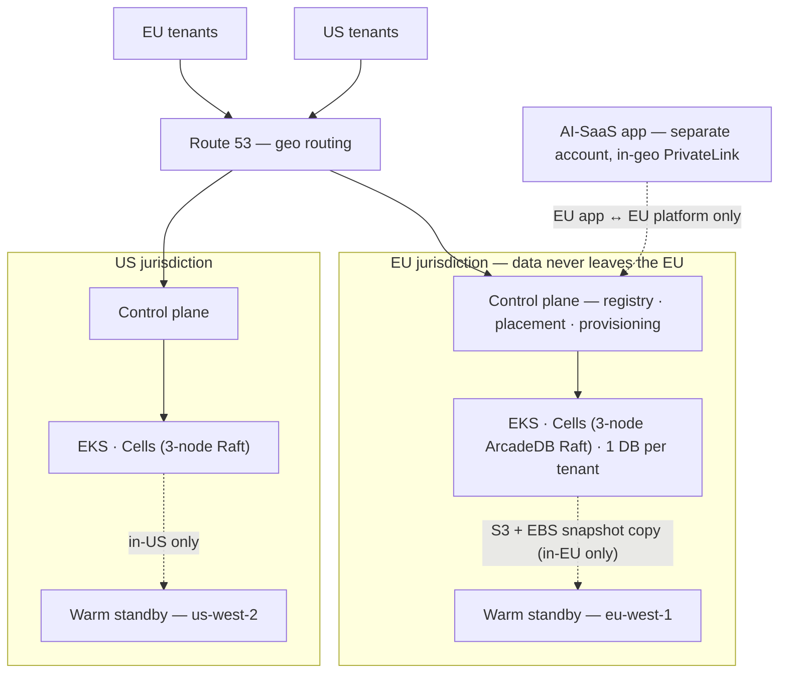

# ArcadeDB on AWS — Design Overview (2-page summary)

> **Audience:** CTO / exec & business. **Status:** CTO approval package (Phase D) —
> for sign-off **before any AWS spend**. **Read next for depth:** the full
> [High-Level Design](architecture.md), the [decision records](adr/), and the
> [assumptions log](assumptions.md). One level up: the [repo README](../README.md).

## The problem / why now

- We need a **production-grade home on AWS for [ArcadeDB](https://arcadedb.com)** — the
  data-layer foundation of a **multi-tenant Knowledge Base for our AI SaaS**.
- **One virtual database per tenant** (ArcadeDB natively hosts many DBs per server — a clean fit).
- **Two jurisdictions from day one — EU + US** — with **hard GDPR residency**: EU tenant
  data and backups never leave the EU.
- Built for a **clean day-one hand-over** to a cloud-ops team (reproducible, observable,
  guard-railed) and **built + operated with Claude Code**, so the AI operating model is
  itself a hand-over deliverable.

We are asking the CTO to approve the **direction and the spend** on concrete evidence —
this design + reasoning + boilerplate templates + the AI kit — *before* we build.

## The solution in one picture

The two geos are **fully independent stacks** with **no connectivity between them** — not
even a management path that could carry data.

## How it works

- **Cell model.** A *cell* = one **3-node ArcadeDB Raft cluster** in its own namespace,
  with its own storage, load balancer, and backup prefix. It is the unit of **capacity,
  blast radius, and tenant placement**. We **scale by adding cells**, not by enlarging a
  cluster — adding a cell is additive + zero-downtime.
- **Tiered tenancy.** Standard tenants share **pooled cells** (cost-efficient); enterprise/
  regulated tenants get **dedicated cells** (the boundary we actually trust for sensitive data).
- **Control plane.** A regional registry (DynamoDB, never a global table) + placement/router +
  an idempotent provisioning state machine create the per-tenant DB, least-privilege user,
  vector + full-text indexes, secret, and backup — all audited.
- **Residency in depth.** Org-level **SCP region-deny** + geo-pinned replication + a registry
  geo-assertion + a **CI policy gate** + per-geo Terraform state — five layers, so no single
  bug or mistake can leak data across jurisdictions.
- **Knowledge Base.** Start **ArcadeDB-native GraphRAG** (graph + vectors + full-text in one
  engine) **behind a swappable interface**, with a documented escape hatch to externalise
  vectors if a benchmark says so — captures the upside while keeping the choice reversible.

## What constrains the design (the load-bearing ArcadeDB facts)

These verified facts are *why this is not a generic "run a database on Kubernetes" plan*:

- **HA is leader-based Raft, GA from v26.4.1, min 3 nodes** → every prod cell is a 3-node
  StatefulSet with a PodDisruptionBudget.
- **No per-database resource quotas** → the control plane caps cell capacity and the
  retrieval proxy enforces per-tenant limits + a kill-switch.
- **No native encryption, audit, or point-in-time recovery; root password is set-once** →
  we encrypt at the AWS layer (KMS), build an app-layer audit trail, and use a special
  root-rotation procedure.
- **Backups are hot per-DB ZIPs (no incremental/PITR/S3 target); restore needs the target
  DB to not exist** → layered backups (ZIP + EBS snapshots) and a careful restore runbook.
- **Official Helm chart, but no Operator** → we own day-2 upgrades (quorum-aware, canary-first).

A **critical cross-DB isolation CVE (CVSS 9.0) was fixed in ≥ 26.4.1**, which is why the
version floor is a hard, enforced invariant.

## Key decisions & why (full reasoning in the [ADRs](adr/))

| Decision | Choice | Why | ADR |
|---|---|---|---|
| Compute | EKS + official Helm chart | Maps 1:1 to ArcadeDB's HA model + richest hand-over ecosystem | [0001](adr/0001-compute-platform-eks.md) |
| Tenancy | Tiered (pooled + dedicated) | Cost for the standard majority; a hard boundary where it's needed | [0003](adr/0003-tenancy-isolation-tiered.md) |
| Cell backing | Namespace-per-cell (cluster for enterprise) | One control plane amortises many cells; blast radius already bounded | [0004](adr/0004-cell-backing-namespace.md) |
| Residency | Per-geo OU + SCP deny (defence in depth) | Audited, legally load-bearing — no single point of failure | [0007](adr/0007-residency-enforcement-scp.md) |
| Version floor | ArcadeDB ≥ 26.4.1, digest-pinned | Closes the CVSS-9.0 isolation CVE + gives GA Raft HA | [0012](adr/0012-version-floor-26-4-1.md) |
| DR | Warm standby, in-jurisdiction | Only posture that hits RTO given no PITR / single-leader Raft | [0014](adr/0014-dr-strategy-warm-standby.md) |
| KB retrieval | Native GraphRAG + escape hatch | One residency/HA/backup story; reversible via a benchmark gate | [0024](adr/0024-kb-retrieval-native-graphrag.md) |
| Scope | Data-layer platform + seams | Stable, certifiable platform; app iterates on top, unblocked | [0025](adr/0025-scope-data-layer-platform.md) |

Full index: [29 ADRs](architecture.md#9-decision-record-index-reasoning-lives-in-the-adrs).

## Cost (order-of-magnitude, on-demand, pre-Savings-Plans)

- **Day-one footprint** (1 pooled cell + 2–3 enterprise cells per geo, both geos):
  **≈ $8.5–12k / month**.
- **Levers:** Graviton + Compute Savings Plans (−30–50% on the dominant compute line),
  VPC endpoints (cut NAT), right-size the page cache, single-node non-prod cells.
- Standard tenants are near-free at the margin; **enterprise economics are dominated by the
  dedicated-cell cost → price it into the enterprise SKU.**

## Top risks & how we de-risk

| Risk | Mitigation |
|---|---|
| ArcadeDB vendor/maturity (niche, young Raft HA) | Support tier; pin + canary upgrades; portable behind `RetrievalProvider` + re-ingestable source |
| Bad upgrade unrecoverable (no PITR) | Canary cells; verified pre-upgrade backup; rehearsed restore-based rollback |
| Cross-tenant isolation regression | Version floor ≥ 26.4.1; continuous isolation probe; dedicated cells for sensitive tenants |
| Native vector recall disappoints | Phase-2 benchmark gate; one-config-flip escape hatch to OpenSearch/pgvector |
| Cost overrun (cross-AZ transfer, vector RAM) | FinOps dashboard; Savings Plans; right-size; single-node non-prod |

## Built & handed over with AI

The repo ships an **AI operating model the cloud-ops team owns and runs**: a `CLAUDE.md`
hierarchy (prime directives), **deterministic guard-rail hooks** (block residency/quorum/
version/public-DB/secret mistakes regardless of who is at the keyboard), and **16 self-contained
skills** (one per runbook: provision, add-cell, upgrade, restore, DR drill, …). This makes
both the build and day-2 operations AI-assisted and **safe by construction**.

## Status & the ask

- **Delivered + locally validated** (no AWS, no credentials): the HLD + 29 ADRs + assumptions,
  parameterised IaC templates (Terraform + Helm + control-plane stubs + CI policy gates), and
  the Claude hand-over kit. `make validate` is green.
- **We ask the CTO to approve** the direction + the spend, and to confirm the
  [open questions](architecture.md#14-open-questions-for-the-cto-decision-points-beforeat-sign-off): per-tenant **data size**
  (A2 — sets capacity/cost), **compliance scope** (A7 — HIPAA now?), and **platform scope**
  (A8 — data-layer + separate app account).
- **On sign-off:** we author the Low-Level Design and execute the build (Phases 0–4).
  **Nothing is applied to AWS until then.**
