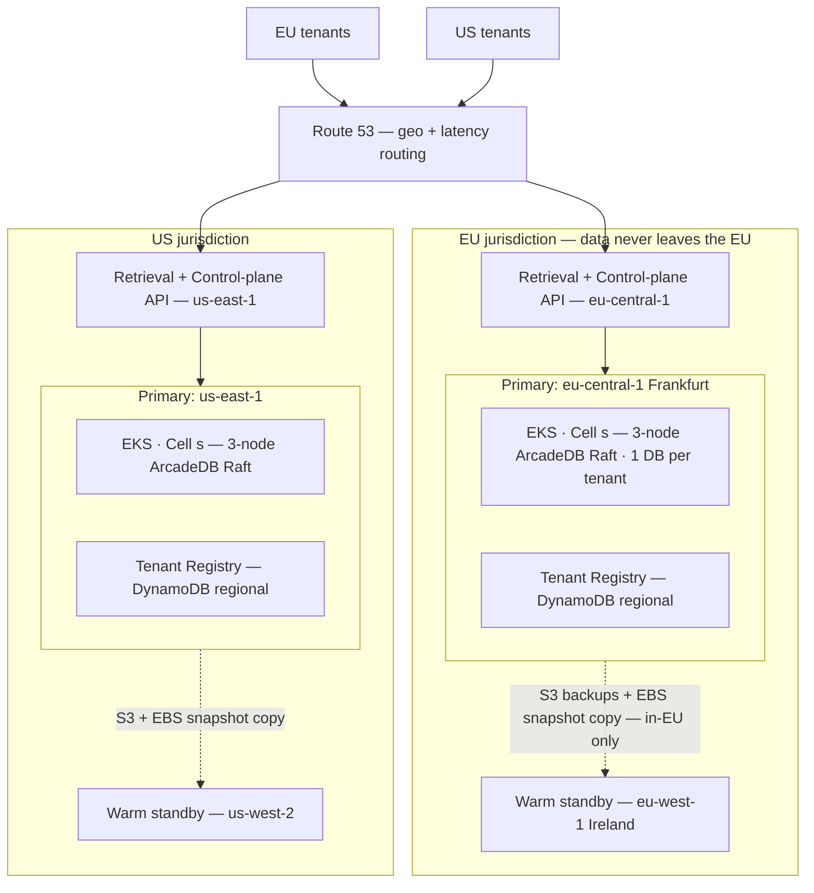
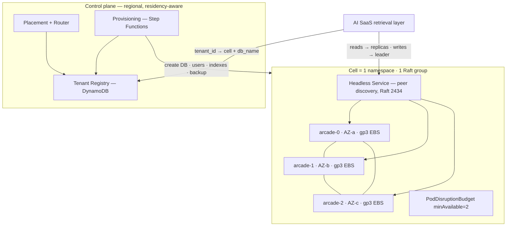
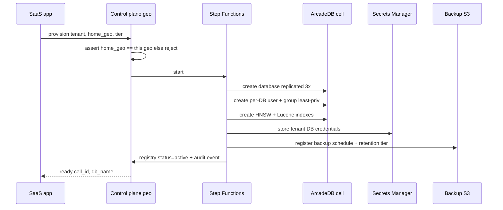
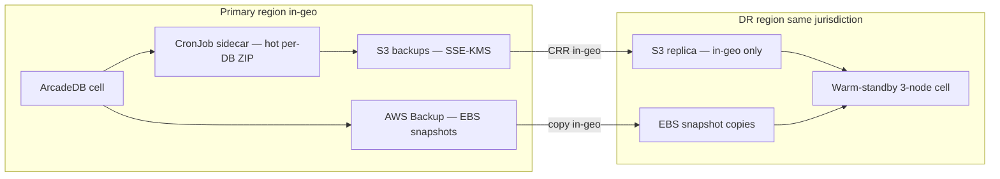
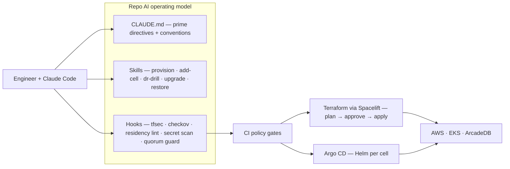

# ArcadeDB on AWS — Multi-Tenant Knowledge Base Platform (Plan v1, comprehensive draft)

> Status: **comprehensive draft, structured for a CTO approval gate.** Nothing has been built. The **first deliverable is a sign-off package for your CTO** (§1.4): a **High-Level Design** doc + diagrams + reasoning (ADRs) + assumptions + **basic boilerplate IaC templates** + the Claude day-one handover kit. The **Low-Level Design** and the fleshed-out build follow *after* approval (Phases 0–4).

---

## 1. Context — why we are doing this

We need a **production-grade home on AWS for ArcadeDB**, which will be the **foundation of a Knowledge Base for our AI SaaS**. The shape of the problem:

- **Multi-tenant SaaS**: each tenant gets **one virtual database** on ArcadeDB (ArcadeDB natively hosts many databases per server — a clean fit for "one DB per tenant").
- **Two jurisdictions from day one**: we deploy in **Europe and the US**, and **EU tenant data must stay in the EU** (GDPR residency).
- **Built for a clean day-one handover** to a cloud ops / hosting team — everything reproducible, observable, documented, and guard-railed so they can run it without us.
- **Built using AI (Claude Code)** — a proper `CLAUDE.md`, custom **skills**, and **hooks** so both the build and the day-2 operations are AI-assisted and safe by construction — and this AI operating model is itself a **handover deliverable** the cloud ops team owns and runs.
- **Deliverables**: a **CTO approval package** (§1.4) — High-Level Design doc + diagrams + reasoning (ADRs) + assumptions + **basic boilerplate IaC templates** + the Claude handover kit — shipped for sign-off *before* the build; then the Low-Level Design + fleshed-out platform (Phases 0–4).

### 1.1 What we verified about ArcadeDB (the load-bearing facts)

These facts (confirmed against the official docs / GitHub) **drive the entire design** — they are why this is not a generic "run a database on EKS" plan:

| Fact | Source | Design consequence |
|---|---|---|
| HA is **leader-based Raft (Apache Ratis)**, GA from **v26.4.1**; **min 3 nodes** for majority quorum; replicas serve reads; replication is **per-database** | [HA docs](https://docs.arcadedb.com/arcadedb/how-to/operations/ha) | Every cell is a **3-node StatefulSet**; PodDisruptionBudget protects quorum; reads can fan to replicas |
| **No per-database resource quotas** (noisy-neighbour is unmitigated at the engine) | [settings](https://docs.arcadedb.com/arcadedb/reference/settings) | The **control plane** must enforce **cell capacity caps**; big tenants get isolated cells |
| **Critical cross-DB isolation CVE (CVSS 9.0)**, fixed in **≥26.4.1** | [GHSA-fxc7-fm93-6q77](https://github.com/ArcadeData/arcadedb/security/advisories/GHSA-fxc7-fm93-6q77) | **Pin ≥26.4.1**, re-audit isolation after every upgrade; the trusted boundary for sensitive tenants is a **dedicated cell** |
| **No native encryption-at-rest**, **no native audit log**, root password is **set-once** | [users docs](https://docs.arcadedb.com/arcadedb/how-to/operations/users) | Encrypt at the **EBS/S3/KMS** layer; build an **app-layer DB-access audit trail**; special root-rotation procedure |
| Backup is **online/hot, per-DB, ZIP, excludes WAL**; **no incremental, no PITR, no native S3 target**; restore requires the **target DB to not exist** | [backup docs](https://docs.arcadedb.com/arcadedb/how-to/operations/backup) | RPO bounded by backup cadence; supplement with **EBS snapshots**; **warm-standby** DR; restore runbook must drop/rename first |
| **Official Helm chart (StatefulSet), no Operator**; `/ready` health (204, no auth); Prometheus at `/prometheus` (known **MIME-type bug**) | [k8s docs](https://docs.arcadedb.com/arcadedb/how-to/operations/kubernetes) · [helm](https://github.com/ArcadeData/arcadedb-helm) | We own day-2 logic (upgrades) ourselves; `/ready` for probes; ship a MIME-fix sidecar if needed |
| **Apache 2.0**, fully open source; native **HNSW vector** + **Lucene full-text** (GraphRAG) | [vector tutorial](https://docs.arcadedb.com/arcadedb/tutorials/vector-search-tutorial) | No license cost; KB can be **graph + docs + vectors in one engine**, behind a swappable retrieval interface |

### 1.2 The decisions you made (this plan's spine)

| Question | Your answer | Locked in as |
|---|---|---|
| Scale | **Design to scale** | Start with **one cell**, build the **control plane** to shard into cells later without rework; **launch example = 50 standard + 2–3 enterprise tenants per geo** (see §2.4) |
| Isolation | **Tiered** | Pooled cells for standard tenants; **dedicated cells** for enterprise/regulated |
| Compute | **EKS / Kubernetes** | Official ArcadeDB Helm chart on EKS, StatefulSets |
| IaC | **Terraform, greenfield** | Terraform/OpenTofu builds the AWS landing zone from scratch |
| KB / vectors | **Recommend** | **ArcadeDB-native GraphRAG** behind a `RetrievalProvider` interface, with a documented **escape hatch** to externalise vectors |
| Availability / DR | **Multi-AZ + cross-region DR** | 3 AZs per cell + **warm-standby** DR region |
| Regions / residency | **EU + US** | **Region = a cell-placement dimension**; **DR stays in-jurisdiction** (EU→EU, US→US) |
| Ops tooling | **AWS-native + Prometheus/Grafana + Secrets Manager** | **AMP + AMG** for metrics/APM, **CloudWatch Logs** via Fluent Bit, **Secrets Manager + External Secrets** |

### 1.3 Scope boundary — what this platform owns vs the AI-SaaS app

**Recommendation: this is a data-layer platform** (cleanest handover — the cloud ops team runs a *data platform*, not the AI application), exposing well-defined seams so the app team is never blocked:

| This platform owns | Seam it exposes | The AI-SaaS app owns |
|---|---|---|
| ArcadeDB clusters/cells, control plane, tenant lifecycle | Provisioning + retrieval API (private) | Ingestion/embedding pipeline; KB ontology / graph-schema *definition* |
| **Schema-migration tooling** (versioned, fan-out across tenant DBs) | Migration API/CLI + schema registry | *Which* schema/ontology to ship and when |
| Per-tenant **usage metering data** (queries, storage, vector ops) | Metered-usage stream / metrics | Billing, rating, showback, plan limits |
| Data-layer **erasure primitives** (drop-DB, crypto-shred, record purge) + deletion evidence | Erasure / DSAR API | The RTBF/DSAR *workflow* + legal process |
| Backups/DR, security, residency, observability | `/ready`, metrics, audit events | App-level SLOs, product features |

This keeps the platform stable and certifiable while the AI app iterates on top. **App connectivity:** the AI-SaaS app runs in a **separate AWS account** and reaches the platform's retrieval/provisioning API over **AWS PrivateLink** (in-geo only: EU app ↔ EU platform) — clean blast-radius, billing, and security separation, residency-preserving. *(You chose "recommend" on both scope and locality; switch to a wider platform scope or co-located app any time — it changes §2.5/§2.10 only.)*

### 1.4 What we ship to the CTO for approval (the package)

The **first deliverable is a sign-off package** — produced *before* any build or AWS apply, so your CTO approves the direction (and the spend) on concrete evidence, not just prose. It bundles:

1. **High-Level Design (HLD)** — `docs/architecture.md`: the end-to-end solution (this plan's §2), the **architecture diagrams**, the **reasoning** (the ADR index §5.1 + the key ADRs written out), and the **assumptions** (§5.2). *(Low-Level Design — module/resource specs, variable & API schemas, CIDR/IAM/KMS detail — is authored **after** approval as `docs/lld.md`; see Phase 0.)*
2. **Basic boilerplate IaC templates** — a deliberate notch above bare skeletons: the full repo tree (§4) as **parameterised, instantiable templates** — complete `variables.tf`/`outputs.tf`/`versions.tf` (provider pins), a basic-but-real **cell module** plus **network / eks / backup-dr / observability** module templates, **example `terraform.tfvars` per geo/env**, a documented Helm **`values.yaml`** template, **CI workflow** templates, and per-module READMEs. `terraform init`/`validate` + `helm lint` + `kubeconform` clean; **not applied to AWS** (account IDs are placeholders; no live resources, no credentials). The cloud ops team can clone these and start from real templates, not a blank page.
3. **The Claude day-one handover kit** — a real `CLAUDE.md`, `.claude/settings.json` hooks, and `.claude/skills/*/SKILL.md` stubs, so the CTO sees the AI operating model the cloud ops team will inherit and run.

**Approval gate:** CTO reviews this package → on sign-off we proceed to the LLD + full build (Phases 0–4). This is **Phase D** in §6. *(Per your call: HLD now / LLD post-approval, with **basic boilerplate templates** — a deliberate notch above bare skeletons so ops get a real starting point, still short of a full applied scaffold. Say the word to go lighter (skeletons) or heavier (fuller scaffold), or to add the LLD up front.)*

---

## 2. Recommended architecture

### 2.1 High-level (multi-geo, residency-locked)



### 2.2 Prime directives (the invariants we never violate — also encoded in `CLAUDE.md` + hooks)

1. **Residency**: EU tenant data and backups stay in EU regions. DR pairs stay in-jurisdiction. No EU↔US data path exists.
2. **Version floor**: ArcadeDB **≥ 26.4.1** (closes the cross-DB isolation CVE + gives Raft HA). Re-audit cross-DB isolation after every upgrade.
3. **Quorum**: every cell runs **3 nodes**, spread one-per-AZ, with a **PodDisruptionBudget `minAvailable: 2`**. Never drop below quorum during drains/upgrades.
4. **No public database**: ArcadeDB ports are never on a public subnet or public load balancer.
5. **Encrypt everything at the platform layer** (EBS/S3/Secrets/snapshots via KMS) — the engine provides none.
6. **No click-ops**: every resource is Terraform/Helm/GitOps; the environment is reproducible from a clean state.
7. **Sizing rule**: pod memory limit ≥ `maxPageRAM` (off-heap page cache) + JVM heap + overhead, or the kernel OOM-kills a node and risks quorum.

### 2.3 AWS landing zone & residency enforcement (greenfield, Terraform)

- **Bootstrap with AWS Control Tower + Account Factory for Terraform (AFT)**, then Terraform owns all workload infra. *Why:* fastest SOC2-credible multi-account baseline (org CloudTrail, Config, Log Archive + Audit accounts) while keeping account vending itself GitOps-driven — needed to vend **geo-scoped** accounts repeatably.
- **Org structure — geo is a hard boundary:**

```
Root
├── Security OU        → log-archive (immutable central logs) · audit (GuardDuty/SecurityHub delegated admin)
├── Infrastructure OU  → shared-services (ECR, Route53, Terraform state, AMG, IPAM)
├── Workloads-EU OU    → eu-dev · eu-stage · eu-prod      ← residency boundary
└── Workloads-US OU    → us-dev · us-stage · us-prod      ← residency boundary
```

- **Regions:** EU primary **eu-central-1 (Frankfurt)** → DR **eu-west-1 (Ireland)**; US primary **us-east-1** → DR **us-west-2**. DR is **jurisdiction-locked**.
- **Residency enforced in depth:** (1) **SCP** on `Workloads-EU` denies any action where `aws:RequestedRegion` ∉ EU allow-list (+ a small global-service allowlist); (2) S3 replication destinations are geo-pinned in Terraform with a validation guard; (3) tenant registry stores `home_geo` and the router refuses cross-geo placement; (4) a **Conftest/OPA CI gate** fails any resource with an out-of-geo region literal — fail before apply; (5) even **Terraform state buckets are per-geo** (EU state in EU).
- **Networking:** one VPC per workload account per region, **3-AZ private subnets** for nodes/DB pods, **no public DB exposure**, IPAM-allocated non-overlapping CIDRs, **VPC endpoints** (S3/ECR/STS/Secrets/Logs/KMS/AMP/…) to cut NAT cost and keep traffic private. No cross-geo connectivity; in-geo DR uses S3/EBS-snapshot copy (AWS-managed), VPC peering only for the single in-geo primary↔DR pair if ever needed.
- **Identity:** **IAM Identity Center (SSO)** federated to your IdP, permission sets per role, **no IAM users**; alarmed break-glass role per prod account; workloads use **EKS Pod Identity** (simpler than IRSA at many-cluster scale, IRSA kept as fallback).
- **Terraform state:** S3 with **native state locking** (Terraform ≥1.10 / OpenTofu), SSE-KMS, versioned, per-geo buckets.

### 2.4 Cell-based model + control plane

**A cell** = *one 3-node ArcadeDB Raft cluster (one StatefulSet) in its own namespace, with its own EBS volumes, load balancer, backup prefix, and registry entry; belongs to exactly one geo + one environment; it is the unit of capacity, blast radius, and tenant placement.*

- **Cell backing:** standard/pooled cell = **a namespace in a shared regional EKS cluster** (one EKS control plane serves many cells → big cost saving, the data blast radius is already bounded by the per-cell Raft group). Enterprise/regulated dedicated cell = optionally a **dedicated EKS cluster**. The cell Terraform module exposes `cell_isolation = "namespace" | "cluster"`.



**Control plane components:**
- **Tenant Registry** — **regional DynamoDB** (PITR on; DR-replicated **within the geo only** via DynamoDB — never a global EU↔US table). Keys: `tenant_id`, `home_geo`, `tier`, `cell_id`, `db_name`, `status`, `size_bytes_last`, `backup_policy`, `secret_arn_pointer`, `consistency_level`.
- **Placement + Router** — picks a cell by `geo + env + tier + has_capacity`, least-loaded; the retrieval layer resolves `tenant_id → cell + db_name` (cached). Two ArcadeDB-specific routing rules: **writes go to the Raft leader** (validate ArcadeDB's leader-forwarding on the pinned version and document the chosen mode); **reads fan to replicas** with `read_your_writes` (or `eventual`) consistency to offload the leader.
- **Cell capacity model** (because there are no per-DB quotas) — a pooled cell is "full" when **any** cap trips: **~150 standard DBs**, or **~60% of `maxPageRAM` committed** to working sets, or **~70% disk**. Big tenants (projected >~50 GB or write/index-heavy) are **never** placed in a pooled cell. *(These numbers are a starting heuristic tied to the data-size assumption in §8 — tune from metrics.)*
- **Day-one footprint (agreed worked example)** — launch = **50 standard + 2–3 enterprise tenants per geo** (~100 standard + ~5 enterprise across EU+US). Per geo: **one pooled cell** (50 of the ~150-DB cap ≈ 1/3 full → wide headroom; cell #2 triggers near ~120–150 standard tenants or the RAM/disk cap, whichever first) **plus 2–3 dedicated enterprise cells** (one tenant each). The same cell module + control plane scale this to thousands by adding cells — no redesign. *This is our discussion anchor; caps and node sizes re-derive from the real per-tenant size distribution (§8).*
- **Provisioning** — an idempotent **Step Functions** state machine (retryable, auditable):



- **Adding a cell is purely additive** (new namespace/StatefulSet/PVCs/LB/backup prefix → forms its own Raft group → registers as available → router places *new* tenants there). **Zero downtime; no existing tenant or Raft group is touched.** Moving an existing hot tenant is a separate explicit migration runbook (hot-backup → restore into new cell → flip registry → drop from old).

### 2.5 EKS + ArcadeDB runtime specifics

- **Nodes:** **Graviton/arm64** (`r7g` family for DB nodes — best price-performance for a RAM/throughput-bound JVM; verify the arm64 image digest in CI). **Managed node groups, one per AZ, for the stateful DB tier** (predictable, AZ-pinned — *do not* let Karpenter consolidate a node out from under a DB pod and bounce quorum); **Karpenter for stateless** (app, controllers, jobs); a small system node group for add-ons.
- **AZ pinning:** EBS is AZ-bound → `StorageClass` gp3, **`volumeBindingMode: WaitForFirstConsumer`**, encrypted with the geo KMS key, `allowVolumeExpansion: true`. Pods pin to their volume's AZ. On full-AZ loss, the other 2 nodes hold quorum; **do not** auto-recreate the lost pod with an empty volume in another AZ (that forces a full re-replication) — handle in the failover runbook.
- **Memory sizing (the #1 gotcha):** give RAM to the **off-heap page cache** (`maxPageRAM`), keep heap modest. Pod memory **limit ≥ heap + maxPageRAM + JVM/OS overhead**, or the pod is OOM-killed and a node leaves Raft. *Worked example:* `r7g.2xlarge` (64 GiB) → `maxPageRAM=32g`, `-Xmx=8g`, pod limit ~46–48 GiB. **Avoid a tight CPU limit** — CPU throttling starves Raft heartbeats → leader flapping.
- **Durability:** `txWalFlush` default `0` = no fsync per commit. Set **`txWalFlush=2` (fsync)** for strict-durability tenants (enterprise/regulated); standard tenants may run `0`/`1` for throughput. Per-tier setting, not default-and-forget.
- **Ingress & app connectivity:** ArcadeDB's own ports never leave the cluster. The platform's **retrieval + provisioning API** is fronted by an **internal NLB → VPC endpoint service (AWS PrivateLink)**, consumed by the **separate app account in the same geo** (EU app ↔ EU platform only); TLS via ACM. In-cluster east-west (control plane ↔ ArcadeDB) uses the ClusterIP/headless Service (HTTP 2480, Bolt 7687). Probes → `/ready` (204) with a generous startup probe. Expose Postgres-wire 5432 via NLB only if an external consumer truly needs it (default: don't).
- **Client resilience on failover:** a Raft leader election creates a brief write-unavailability window. The DB client in the retrieval layer must **retry with backoff, re-discover the leader**, make writes **idempotent where possible**, and keep reads flowing to replicas. Define and **test the failover-window behaviour** (target: writes resume within the election timeout + a few seconds).
- **Upgrades (no operator → we own it):** quorum-aware rolling upgrade — pre-flight health + fresh backup, **upgrade replicas first one-at-a-time** (wait for re-join + lag→0 + `/ready`), **leader last** (graceful step-down), confirm mixed-version Raft compatibility, **re-audit cross-DB isolation** after. Automate as an Argo Workflow with health gates — never rely on default StatefulSet rollout alone. Roll out **canary cell → one prod cell → fleet**. **Rollback caveat (critical):** upgrades are effectively **forward-only** — no PITR, and an on-disk format change can make a downgrade impossible, so the only true rollback is **restore-from-backup to the prior version**. Before any upgrade: verified fresh backup, read release notes for format/compat changes, and rehearse the restore-based rollback on the canary.

### 2.6 Security & compliance baseline (SOC2-ready + GDPR residency)

- **KMS:** per-geo, per-account CMKs (separate keys for EBS, S3, Secrets, AMP, snapshots), rotation on; **per-tenant CMK option** for enterprise cells (crypto-shred on offboarding).
- **Encryption everywhere** (the only at-rest encryption ArcadeDB gets): EBS/S3/Secrets/snapshots SSE-KMS; TLS at ALB/NLB; east-west starts NetworkPolicy+private-subnet, **add mTLS (mesh or ArcadeDB native keystore) for enterprise/regulated cells**.
- **Network isolation:** private subnets only for data; least-privilege security groups (DB ports only from the cluster SG); **default-deny Kubernetes NetworkPolicies** per cell namespace (a primary cross-tenant containment control in pooled cells). CNI: **Cilium** for L7/identity-aware policy + better inter-namespace observability (alt: VPC CNI).
- **Secrets:** **Secrets Manager + External Secrets Operator** via Pod Identity. **Root password is set-once** → generate before first boot, inject via env, mark the secret immutable, and document that "rotating root" means provisioning a new admin server-user (not re-setting the init var). **Per-tenant DB credentials are normal, rotatable secrets** (rotation Lambda → ArcadeDB `ALTER USER` → Secrets Manager → ESO re-sync).
- **Audit (no native DB audit → 3 layers):** (1) AWS-plane: org CloudTrail, Config, VPC Flow Logs, ALB/NLB access logs, EKS audit logs → immutable log-archive S3; (2) **app-layer DB-access audit** — the retrieval/data service emits a structured event (tenant, principal, db, op, ts) for every privileged/tenant data op (this is the SOC2 substitute for engine audit — design it in Phase 2, not bolted on); (3) HTTP access logs. **GuardDuty (EKS Runtime) + Security Hub** org-wide, delegated to the audit account.
- **Supply chain:** **ECR per region, scan-on-push** (Inspector), **Trivy** CI gate, **cosign** signing + Kyverno/Gatekeeper admission rejecting unsigned/critical-CVE images; mirror the pinned ArcadeDB image into ECR.
- **Cross-tenant isolation — explicit stance:** pooled cells are a **cost optimisation** for standard tenants; the **boundary we actually trust for sensitive data is the dedicated cell**. Mitigations layer: version pin + post-upgrade re-audit, tiering, per-DB least-privilege users, NetworkPolicy + app routing, capacity caps.
- **GDPR data-subject primitives (erasure / RTBF / DSAR):** the platform provides the **data-layer mechanics** the app's RTBF/DSAR workflow calls into — per-tenant **DB drop**, **per-tenant KMS crypto-shred** (enterprise), targeted **record purge** within a tenant DB, and **deletion evidence** (audit event + certificate). One-DB-per-tenant makes whole-tenant erasure clean; intra-tenant subject erasure is a record-purge call. The app owns the *workflow* and legal process (the §1.3 seam).

### 2.7 Backup, DR & business continuity



- **Layered backups:** (A) **hot per-DB ZIP via a CronJob sidecar** that calls the backup API → verifies → uploads to S3 (no native S3 target) → records status in the registry (preferred over the in-engine auto-backup plugin for observability + S3 control). Cadence: standard **6h**, enterprise **1h**; tiered retention; bucket layout `s3://kb-backups-<geo>-<env>/cell/<cell>/<tenant>/<ts>.zip`, **CRR in-geo only**, Object Lock for enterprise. (B) **AWS Backup EBS snapshots** every 4–6h (captures WAL/on-disk state the ZIP omits), KMS-encrypted, copied to the in-geo DR region.
- **Restore runbook bakes in the gotcha:** **the target DB must not exist** → drop/rename first, then restore the ZIP, **rebuild HNSW/Lucene indexes** + per-DB users, re-register backup, smoke-test, audit. Whole-cell recovery prefers EBS-snapshot restore over restoring 150 ZIPs.
- **DR = warm standby (per geo, in-jurisdiction):** a minimal running 3-node cluster in the DR region, fed by in-geo S3 + snapshot copies; failover = scale up + promote + repoint the (already in-geo DR-replicated) registry + flip Route 53. *Not pilot-light* (ArcadeDB restore + index rebuild is too slow for RTO); *not active-active* (Raft is single-leader per cluster, no built-in cross-region replication).
- **RPO/RTO (honest):** standard **RPO ≤ 6h / RTO ≤ 4h**; enterprise **RPO ≤ 1h / RTO ≤ 1–2h**. *No PITR means near-zero RPO is impossible with native tooling* — the escape hatch is keeping the **ingest source re-ingestable** so the KB can be rebuilt. **DR game-day quarterly per geo; restore-a-random-tenant monthly** ("untested backups are not backups").

### 2.8 Observability & SLOs

- **Metrics:** ADOT/Prometheus agent scrapes ArcadeDB `/prometheus` + JVM + node + kube-state → **Amazon Managed Prometheus**; **Amazon Managed Grafana** dashboards/alerts. **Handle the `/prometheus` MIME-type bug** (returns `application/json`): force the text parser in the scrape config, or run a tiny header-rewriting sidecar — validate in Phase 1 and bake the workaround into Helm values.
- **Alert on:** quorum lost (<2/3 → page immediately), leader flapping, replication lag, page-cache eviction/hit-ratio (working set > `maxPageRAM`), JVM GC/heap, **OOMKilled** pods, EBS %used >75/85%, IOPS/throughput throttling, **backup failure / last-backup-age > SLA**, DR replication lag, TLS/cert expiry <30d, ESO sync failures, **capacity caps crossed** ("cell nearing full"), break-glass use.
- **Logs:** Fluent Bit → **CloudWatch Logs** (configure ArcadeDB `java.util.logging` to JSON/stdout), per-cell log groups, KMS-encrypted, export to log-archive S3 for long retention.
- **Per-tenant usage metering:** emit per-tenant metrics (query count/latency, storage bytes, vector ops, write volume) → AMP + a **metered-usage stream** the app/billing consumes (the §1.3 seam). Doubles as **noisy-neighbour detection** and capacity input.
- **Distributed tracing:** OpenTelemetry traces across **app → PrivateLink → retrieval/control-plane → ArcadeDB** (ADOT → AMP/Tempo or X-Ray) so GraphRAG latency is attributable per hop and per tenant.
- **SLOs:** read-path availability **99.9%/mo**, write-path **99.5%**, retrieval read p95 **<150ms** in-cell (excludes embedding/LLM hops), write p95 **<500ms** (higher with `txWalFlush=2`), RPO/RTO per §2.7. Error budget governs change freezes. **Routing:** Grafana/Alertmanager → SNS → PagerDuty (P1 quorum/region; P2 capacity/backup to Slack+ticket), CloudWatch Synthetics canaries per geo.

### 2.9 CI/CD & GitOps

- **CI:** GitHub Actions (build/test the retrieval + control-plane code, build+scan+sign images, mirror the pinned ArcadeDB image to ECR per region).
- **Terraform runner:** **Spacelift** (stack dependencies, drift detection, OPA policy gates, **mandatory manual approval on prod / any geo-prod apply**); Atlantis is the budget alternative.
- **GitOps:** **Argo CD** app-of-apps, **per-cell ApplicationSets** (adding a cell = adding a generator entry), ArcadeDB Helm values templated per cell.
- **Promotion:** dev→stage→prod folders × an **eu/us geo overlay**. Promote **config/infra only, never data**.
- **Policy gates (block merge/apply):** tfsec + checkov (Terraform), Trivy (images/IaC/SBOM), **Conftest/OPA** incl. the **residency region-allowlist check** and "no public DB SG", kubeconform/Kyverno (signed-image admission). **Residency is a hard CI gate, not just an SCP.**

### 2.10 Knowledge Base / retrieval (recommendation)

**Start ArcadeDB-native** — graph + documents + **HNSW vectors** + **Lucene full-text**, composed into **GraphRAG** (vector recall → graph traversal for context expansion → full-text rerank) — **behind a `RetrievalProvider` interface**. *Why:* one engine, one backup/residency/HA story, and true GraphRAG (graph + vector co-located) is the differentiator. *Risks (flagged):* HNSW maturity, **vector-index RAM competes with the page cache** (count vector RAM in the capacity model), recall quality. **Escape hatch:** because retrieval is behind an interface, externalise **vectors only** to **OpenSearch Serverless (vector)** or **Aurora pgvector** (in-geo) by flipping a provider config — no app rewrite. **Decision gate:** a Phase-2 recall/latency/RAM benchmark on real KB data; if native fails it, take the escape hatch before GA. **Scope (per §1.3):** the platform exposes the **write/index + bulk-load APIs** and the `RetrievalProvider`; the **ingestion/embedding pipeline, chunking, embedding-model choice (e.g. Bedrock), and re-embedding/backfill on model change are app-owned** — and that re-ingestable source is exactly the sub-hour-RPO escape hatch from §2.7.

### 2.11 ArcadeDB scaling model & ceilings (know these before capacity planning)

ArcadeDB scales differently from a sharded DB — make these explicit so capacity planning is honest:
- **Single-leader write ceiling per cell.** All writes for a cell funnel through its Raft leader → per-cell write throughput is bounded by **one node**. Scale writes by **spreading tenants across more cells**, not by enlarging a Raft group.
- **No intra-cell sharding of a single DB.** Every node holds a **full replica** of every database in the cell (replication is per-DB). A single tenant DB cannot be split across nodes — its size/working-set is bounded by **one node's disk/RAM**.
- **Scaling unit = node size + number of cells.** Grow vertically (bigger `r7g`/`io2`) up to a point, then **shard tenants into more cells**. A tenant that outgrows a node → **dedicated cell on a larger instance** (or the externalise-vectors escape hatch to shed RAM).
- **Read scaling couples to storage.** Adding replicas beyond 3 scales reads, but each replica stores the **full** cell → read capacity and storage cost rise together.
- **Tenant moves incur near-downtime.** No live per-DB migration: moving a tenant between cells is hot-backup → restore → cut over, so that tenant sees a brief write-freeze/read-only window. Schedule moves; rebalancing is not transparent.

### 2.12 Runtime tenant governance (real-time noisy-neighbour control)

Capacity caps (§2.4) bound *placement*; they do **not** stop one tenant's runaway query (a deep traversal, a large vector scan, a Gremlin OLAP job) from saturating a pooled cell live — the engine has **no per-DB quotas**. The **retrieval/proxy layer therefore enforces, per tenant**:
- **Query timeouts** + result/row caps; reject or queue beyond a concurrency limit.
- **Rate limits** (QPS + heavy-op budget) per tenant/tier with fair-share scheduling.
- **A cost guard / circuit breaker** that sheds or isolates a tenant degrading co-tenants, plus a **manual kill-switch** (suspend a tenant's traffic) in the `incident-triage` skill.
- **Continuous cross-tenant isolation probe** — an automated canary that *attempts* cross-DB access on every cell and **alerts if it ever succeeds** (given the CVSS-9.0 CVE history; complements the one-time post-upgrade re-audit).
- Enterprise tenants sidestep most of this by being **alone in a dedicated cell**.

### 2.13 Schema & migration management across tenant DBs

With one DB per tenant, evolving the KB schema/indexes is a **fan-out** problem the platform owns as tooling:
- **Versioned migrations** (a `schema_version` per DB in the registry) applied by an idempotent **migration runner** (Step Functions / Argo Workflow) that fans out across all tenant DBs in a cell/geo, **batched + rate-limited** to avoid a write storm.
- **Online, additive-first changes** (new types/properties/indexes) with **HNSW/Lucene index builds backgrounded**; avoid blocking rebuilds on hot tenants.
- **Canary + staged rollout** (one tenant → one cell → fleet), **per-tenant rollback** to the prior schema version, and a **dry-run/plan** that reports what each DB will change.
- Exposed to the app team via a **migration API/CLI + schema registry** (the §1.3 seam): the app decides *what* ontology ships, the platform guarantees *how* it rolls out safely. Surfaced as the `migrate-schema` skill with safety checks + progress + rollback.

---

## 3. Building & operating with Claude Code (the "with AI" pillar)

The platform is **built and run with Claude Code as a force multiplier**. The repo ships an AI operating model so that both we (build) and the cloud ops team (run) get the same guard-rails and the same one-command procedures.



### 3.1 `CLAUDE.md` hierarchy (project memory)

| File | Contents |
|---|---|
| `/CLAUDE.md` (root) | The **prime directives** (§2.2), repo map, tech stack + **pinned versions** (ArcadeDB ≥26.4.1, TF/Tofu ≥1.10, chart version), the tiering rules, "never click-ops / always plan before apply", pointers to ADRs + runbooks |
| `/terraform/CLAUDE.md` | Module boundaries, state layout, naming, **residency policy**, how to run plan/apply via Spacelift, policy gates |
| `/helm/CLAUDE.md` | ArcadeDB values conventions, the **sizing rule** (`maxPageRAM` + heap + overhead ≤ pod limit), the quorum-preserving upgrade procedure, the `/prometheus` MIME workaround |
| `/control-plane/CLAUDE.md` | Registry schema, provisioning invariants (geo assertion, least-priv users, audit event), restore "target-DB-must-not-exist" rule |
| `/docs/CLAUDE.md` | ADR + runbook + assumptions-log templates; the enforced rule that **every decision gets an ADR stating its reasoning, and every assumption a `docs/assumptions.md` entry** (rationale · impact-if-wrong · validation owner · linked ADR) |

### 3.2 Skills (`.claude/skills/<name>/SKILL.md`) — runbooks as guided, partially-automated procedures

**Run-time (day-2 ops):**
- `provision-tenant` / `deprovision-tenant` — drive the Step Functions flow with safety checks (geo assertion, least-priv users, index + backup + secret creation, audit).
- `add-cell` / `retire-cell` — scaffold a new cell (Terraform instance + Argo ApplicationSet entry + registry catalog), zero-downtime checklist.
- `upgrade-arcadedb` — the quorum-preserving rolling upgrade (replicas first, leader last, PDB check, post-upgrade isolation re-audit).
- `restore-tenant` — restore from S3 with the target-DB-must-not-exist guard + index rebuild + smoke test.
- `dr-drill` — execute a per-geo DR game-day (promote warm standby, Route53 flip, measure RPO/RTO, fail back).
- `rotate-secrets` — per-tenant rotation + the set-once root special procedure.
- `cell-capacity-report` — read AMP metrics, report DBs/cell vs caps, recommend add-cell vs rebalance.
- `incident-triage` — guided runbook for quorum loss / leader flap / OOMKill / disk-full / AZ loss / region loss; includes the per-tenant **kill-switch**.
- `migrate-schema` — fan-out a versioned schema/index migration across tenant DBs (dry-run → canary → fleet, batched, per-tenant rollback).
- `tenant-usage-report` — per-tenant usage/cost + noisy-neighbour view from the metering stream.
- `tenant-erasure` — execute the data-layer RTBF/DSAR primitives (drop / crypto-shred / record-purge) + emit deletion evidence.

**Build-time:**
- `review-terraform-plan` — analyse a `terraform plan` for risky changes (DB SG opened to the world, destroy of stateful resources, residency violation, KMS/role changes) before approval.
- `new-adr` — scaffold an ADR from the template.
- `security-baseline-check` — run the SOC2/residency posture checks (SCP present, encryption on, no public DB, audit layers wired).

### 3.3 Hooks (`.claude/settings.json`) — guard-rails the harness enforces (not memory)

| Event / matcher | Hook action |
|---|---|
| `PreToolUse` · Bash | Block `terraform apply`/`destroy` on **prod** without an approved plan artifact; block `kubectl delete (statefulset\|pvc\|pdb)` / non-allowed prod context; block `aws` calls in a region outside the stack's geo (residency); **gitleaks** secret scan before commits |
| `PreToolUse` · Edit/Write | Block edits that set the ArcadeDB image **< 26.4.1**, open a Security Group to `0.0.0.0/0` on DB ports, set **`replicas < 3`** or remove the **PDB** on the ArcadeDB StatefulSet, or set pod memory limit below `maxPageRAM + heap`; **residency linter** (no non-allowed region literal in an EU stack) |
| `PostToolUse` · `*.tf` | `terraform fmt` + `tflint` + **tfsec/checkov** + **Conftest/OPA** (residency + "no public DB") |
| `PostToolUse` · charts/manifests | `helm lint` + `kubeconform` + Kyverno policy check |
| `PostToolUse` · control-plane code | unit tests / type checks |
| `UserPromptSubmit` | Inject active **geo/env/cell** context + a one-line reminder of the prime directives |
| `SessionStart` | Load the current cell catalog / environment context |

*(Hooks are the right mechanism here because they are deterministic guard-rails the harness runs — they make residency, quorum, version-floor, and "no public DB" violations hard to commit, which is exactly what makes the handover safe.)*

### 3.4 Optional MCP / tooling
AWS + Terraform MCP servers for richer inspection; Workflows/subagents for big fan-out sweeps (e.g., a cross-cell **security audit** or **cost review** that reads every cell's config in parallel and reports). Optional, added once the core is in place.

### 3.5 The AI operating model is a first-class handover asset (built for cloud ops, not just us)

The `.claude/` directory (the `CLAUDE.md` hierarchy, skills, hooks, `settings.json`, MCP config) ships **in the repo** and is **handed over to and owned by the cloud ops team** — so they operate the platform with the same AI assistance and the same guard-rails we built with:

- **1:1 runbook ⇄ skill map** — every operational runbook (§7) has a matching skill, so ops execute procedures AI-assisted (`/provision-tenant`, `/add-cell`, `/dr-drill`, `/upgrade-arcadedb`, `/restore-tenant`, `/rotate-secrets`, `/cell-capacity-report`, `/incident-triage`, `/migrate-schema`, `/tenant-usage-report`, `/tenant-erasure`). Each `SKILL.md` is **self-contained** (prerequisites, inputs, safety checks, verification) so a new operator runs it without tribal knowledge.
- **Guard-rails protect ops, not just builders** — the hooks (§3.3) hard-block the dangerous mistakes (image <26.4.1, `replicas<3`/PDB removal, public DB SG, out-of-geo region literal, secrets in diffs) no matter who is at the keyboard, so ops can move fast safely.
- **Ops-tuned settings/permissions** — a project `.claude/settings.json` with an allowlist of safe read-only commands + mandatory prod approval gates, runnable from the **ops team's own machines/CI** (skills reference repo-relative scripts + SSO permission-set roles, never a builder's laptop state).
- **"Operating this platform with Claude Code" guide** (`docs/runbooks/claude-code-operations.md`) — install/run Claude Code, the permissions model, which skill maps to which runbook, what each hook enforces and why, and how to safely extend a skill/hook.
- **Enablement, not just transfer** — in Phase 4 the ops team runs a real provision + a tenant restore + a partial DR drill **using the skills**, and adds/edits one skill themselves, as part of sign-off.
- **Optional standing automation** — scheduled Claude agents/cron for routine checks (capacity report, backup-age audit) the ops team can adopt.

---

## 4. Repository structure & critical files to author

> **In the CTO package, every path below ships as a *basic boilerplate template*** — parameterised + instantiable: complete variable/output schemas + provider pins, a basic-but-real module body, example `tfvars`, and a `README.md`. `terraform init`/`validate` + `helm lint` clean; **not applied to AWS** (account IDs are placeholders). Items tagged **(real now)** are authored in full; the rest become richer in Phases 0–4.

```
arcadedb/
├── CLAUDE.md                              # root project memory + prime directives                       (real now → CTO package)
├── .claude/
│   ├── settings.json                      # hooks (guard-rails)                                          (real now → CTO package)
│   └── skills/                            # provision-tenant, add-cell, dr-drill, upgrade-arcadedb, …    (SKILL.md stubs real now)
├── terraform/
│   ├── landing-zone/main.tf               # Org/OUs, SCPs (residency deny), IAM IC, KMS, state, guardrails  [Phase 0]
│   ├── modules/network/                   # VPC, 3-AZ private subnets, endpoints, IPAM
│   ├── modules/eks/                       # regional cluster, node groups (per-AZ stateful + Karpenter)
│   ├── modules/cell/main.tf               # reusable cell: StatefulSet/Helm, gp3-KMS SC, PDB, LB, backup prefix; cell_isolation/geo/env/tier vars  [Phases 1–3]
│   ├── modules/backup-dr/main.tf          # CronJob/auto-backup, S3 SSE-KMS + geo-locked CRR, AWS Backup, warm-standby  [Phase 3]
│   └── modules/observability/             # AMP, AMG, alerts, Fluent Bit → CloudWatch
├── helm/arcadedb/values.yaml              # pinned 26.4.x image, replicas=3, AZ anti-affinity, maxPageRAM/heap/limits, txWalFlush, /ready probes, /prometheus MIME workaround  [Phase 1]
├── control-plane/
│   ├── registry/schema.ts                 # tenant registry + cell catalog
│   ├── provisioning/statemachine.asl.json # Step Functions provision/deprovision
│   └── router/                            # placement + leader-aware routing + read/write split
├── docs/
│   ├── architecture.md                    # HLD — architecture + diagrams + reasoning + assumptions       (real now → CTO package)
│   ├── lld.md                             # LLD — module/resource specs, var & API schemas, CIDR/IAM/KMS  (post-approval, Phase 0)
│   ├── assumptions.md                     # living Assumptions & Decision Log                             (real now → CTO package)
│   ├── adr/NNNN-*.md                       # ADR/decision: context·assumptions·options·decision·reasoning·consequences  (key ADRs real now)
│   └── runbooks/                          # operational runbooks incl. claude-code-operations.md (the ops guide)
└── .github/workflows/                     # CI + policy gates (tfsec, checkov, trivy, conftest, kubeconform, cosign)
```

---

## 5. Architecture decision records (the separate reasoning doc)

All reasoning and every assumption live **outside this plan**, in three living reference docs created in **Phase 0** and kept current:

- **`docs/architecture.md`** — the **High-Level Design (HLD)**: end-to-end solution narrative + all diagrams + an **Assumptions & rationale** section. **Ships in the CTO package.**
- **`docs/lld.md`** — the **Low-Level Design (LLD)**: per-module/resource specs, Terraform variable & output schemas, control-plane API + data schemas, the Step Functions ASL, and the CIDR/IAM/KMS/Helm-values detail. **Authored after CTO sign-off (Phase 0)** and kept in lock-step with the IaC.
- **`docs/adr/NNNN-*.md`** — one ADR per decision, using a fixed template: **Context · Assumptions it rests on · Options considered (with pros/cons) · Decision · Reasoning (why this beats the alternatives) · Consequences · Status · Review-trigger**. **Key ADRs ship in the CTO package.**
- **`docs/assumptions.md`** — a living **Assumptions & Decision Log** (seeded in §5.2) recording every assumption with its rationale, impact-if-wrong, confidence, validation owner, and linked ADR. **Ships in the CTO package.**

**Rule (enforced as a CLAUDE.md convention + CI check): no decision lands without an ADR that states its reasoning, and no assumption stands without a log entry.** The §8 list and every in-line assumption (cell caps, instance sizes, cost basis, leader-forwarding, vector recall) migrate into these docs in Phase 0 and are revisited at each review-trigger.

#### 5.1 ADR index (status: ✅ decided by you · ⭐ recommended, you can override — each row links to its full ADR with reasoning)

| ADR | Decision | Choice | Main alternative |
|---|---|---|---|
| 0001 | Compute platform | ✅ EKS | ECS / EC2 |
| 0002 | IaC tool | ✅ Terraform/OpenTofu greenfield | CDK / CloudFormation |
| 0003 | Tenancy isolation | ✅ Tiered (pooled + dedicated) | Pure pooled / pure siloed |
| 0004 | Cell backing | ⭐ Namespace-per-cell (cluster for enterprise) | One EKS per cell |
| 0005 | Landing zone | ⭐ Control Tower + AFT | Pure-Terraform LZ |
| 0006 | Regions | ⭐ euc1→euw1, use1→usw2 | Other EU/US pairs |
| 0007 | Residency enforcement | ⭐ Per-geo OU + SCP deny | App-layer only |
| 0008 | Tenant registry | ⭐ Regional DynamoDB | Global table |
| 0009 | Node compute | ⭐ Graviton arm64 | x86 |
| 0010 | Node provisioning | ⭐ MNG (stateful) + Karpenter (stateless) | All-Karpenter |
| 0011 | Workload identity | ⭐ EKS Pod Identity | IRSA |
| 0012 | Version floor | ⭐ ArcadeDB ≥26.4.1 | Older / latest-unpinned |
| 0013 | Durability | ⭐ `txWalFlush` per tier | Global default |
| 0014 | DR strategy | ⭐ Warm standby | Pilot light / active-active |
| 0015 | Backup mechanism | ⭐ CronJob sidecar → S3 | Auto-backup plugin |
| 0016 | Snapshot orchestration | ⭐ AWS Backup | DLM |
| 0017 | Observability | ✅ AMP + AMG + CloudWatch Logs | Datadog / self-managed |
| 0018 | Secrets | ✅ Secrets Manager + ESO | Vault / SSM |
| 0019 | TLS/mTLS | ⭐ ALB-terminated + NetworkPolicy; mesh for enterprise | Native keystore everywhere |
| 0020 | TF runner | ⭐ Spacelift | Atlantis / TFC |
| 0021 | GitOps | ⭐ Argo CD | Flux |
| 0022 | State locking | ⭐ S3 native | DynamoDB |
| 0023 | CNI/NetworkPolicy | ⭐ Cilium | VPC CNI |
| 0024 | KB retrieval | ⭐ ArcadeDB-native GraphRAG + escape hatch | External vector store |
| 0025 | Scope boundary | ⭐ Data-layer platform + seams | Own ingestion/retrieval / full-KB |
| 0026 | App connectivity | ⭐ Separate account + in-geo PrivateLink | Co-located in-cluster |
| 0027 | Runtime tenant governance | ⭐ App-layer timeouts/rate-limits/circuit-breaker + kill-switch | Rely on placement caps only |
| 0028 | Schema migration | ⭐ Versioned fan-out runner (canary→fleet) | Ad-hoc per-DB scripts |
| 0029 | Upgrade rollback | ⭐ Canary + restore-based rollback | Forward-only, no rollback |

#### 5.2 Assumptions & Decision Log (seed → `docs/assumptions.md`, kept current)

Every assumption is logged with **why we made it**, what breaks **if it's wrong**, and **how/when we validate it** — so a reviewer (or the cloud ops team) can see the reasoning, not just the conclusion:

| ID | Assumption | Why we assume / chose it (reasoning) | Impact if wrong | Validate (owner / when) | Link |
|---|---|---|---|---|---|
| A1 | Budget: cost-conscious, not cost-starved | Pay for managed control-plane (AMP/AMG/Secrets) + Graviton, defer premium tiers → fastest safe baseline | Instance tiers / HA-in-dev change | Confirm w/ finance | §7 |
| A2 | Per-tenant size: std 1–20 GB, ent ≤500 GB | Sets cell caps + node sizing; most B2B KBs are small-to-mid | Re-derive caps, re-size nodes, cost shift | Measure first ~20 tenants (platform owner) | §2.4·§2.11·ADR-0003 |
| A3 | Launch 50 std + 2–3 ent /geo (confirmed) | You confirmed; anchors capacity + cost | Cell count + cost shift | Confirmed | §2.4 |
| A4 | Read-heavy RAG, write bursts on ingest | Drives read-replica fan-out + single-leader writes + `txWalFlush` tiering | Write-ceiling planning changes | Load test (Phase 1–2) | §2.5·§2.11 |
| A5 | ArcadeDB leader-forwarding is reliable for writes | Lets the client route via the Service (simpler) | Client must discover the leader itself | Phase-1 validation | §2.4 |
| A6 | Native HNSW recall/latency/RAM is acceptable | Unified GraphRAG = fewer moving parts | Take the externalise-vectors escape hatch | Phase-2 benchmark gate | §2.10·ADR-0024 |
| A7 | Compliance = SOC 2 + GDPR now, HIPAA later | Standard B2B path; HIPAA via dedicated cells when needed | Add BAA / dedicated cells / controls | Confirm w/ legal | §2.6 |
| A8 | Scope = data-layer; app in separate acct via PrivateLink | Cleanest handover + blast-radius/billing separation | Platform must own more (ingestion/metering/RTBF) | Confirm w/ app team | §1.3·ADR-0025/0026 |
| A9 | euc1/euw1, use1/usw2 have full service parity | AMP/AMG/EKS/Secrets GA there; keeps EU DR in-EU | Swap regions | Phase-0 check (date-stamped) | §2.3·ADR-0006 |
| A10 | Cost basis = on-demand list, both geos, pre-Savings-Plans | Conservative upper bound for planning | Real bill lower w/ SP/RIs | FinOps review | §7 |

---

## 6. Rollout phases (deliverables + exit criteria)

**Phase D — Design & boilerplate package (CTO approval gate).** Produce the §1.4 package *before any build*: the **HLD** (`docs/architecture.md` — architecture + diagrams + reasoning/ADRs + assumptions), the **basic boilerplate IaC templates** (the full §4 repo tree as parameterised, instantiable templates — variable/output schemas + provider pins + basic module bodies + example `tfvars` + Helm `values.yaml` + CI workflows + per-module READMEs, validated with `terraform init`/`validate` + `helm lint`, **not applied to AWS**), and the **Claude handover kit** (`CLAUDE.md`, `.claude/settings.json` hooks, `.claude/skills/*/SKILL.md` stubs). *Exit:* **CTO signs off** on direction + spend. **No AWS resources are created in this phase.**

**Phase 0 — Foundations / landing zone (post-approval).** Author the **LLD** (`docs/lld.md`) as the first real modules land; Control Tower + AFT; OUs + SCPs (incl. **residency deny**); IAM Identity Center; KMS; per-geo Terraform state; CloudTrail/Config/GuardDuty/SecurityHub; VPCs (EU+US, 3-AZ, endpoints); ECR; CI skeleton + policy gates; finalise `docs/architecture.md` + `docs/assumptions.md` + ADRs + the ADR/assumption-logging convention + CI check. *Exit:* reproducible from clean state; **SCP provably blocks a non-EU region action in an EU account**; state locking verified; **every decision has an ADR stating its reasoning, every assumption a log entry with rationale + impact + owner**.

**Phase 1 — Single-cell EKS + ArcadeDB HA (one geo first).** Regional EKS; per-AZ stateful node groups + Karpenter; ArcadeDB Helm StatefulSet (3 nodes, anti-affinity, gp3-KMS PVCs, **PDB**, headless service); pinned 26.4.x image mirrored+signed; sizing; **validate pod-reschedule re-join, `/prometheus` scrape, leader-aware writes**. **Non-prod cells run single-node (no HA) to control cost; prod cells are 3-node.** *Exit:* kill any one pod/AZ → cluster stays available + rejoins clean; quorum-preserving rolling upgrade works; basic dashboards + quorum alert live.

**Phase 2 — Control plane + tenant lifecycle.** Regional registry + cell catalog (PITR, in-geo DR); placement/router + **client-failover resilience**; **capacity caps wired to alarms**; Step Functions provision/deprovision (DB + users + HNSW/Lucene indexes + backup + secret); **runtime tenant governance (per-tenant timeouts / rate-limits / circuit-breaker + kill-switch) + continuous cross-tenant isolation probe**; **schema-migration runner**; **per-tenant metering stream + erasure primitives**; **app-layer DB-access audit**; backup sidecar → S3; **run the native-vs-external vector benchmark**. *Exit:* provision/deprovision a standard tenant end-to-end, idempotent + audited; cap triggers "cell nearing full"; a runaway tenant is contained without breaching co-tenant SLO; **backup→restore round-trip proven**.

**Phase 3 — Multi-region / residency + cross-region DR.** Stand up the **second geo**; in-geo **warm-standby** DR cells; geo-locked S3 CRR + EBS snapshot copy; AWS Backup; Route 53 geo routing + health checks; **cross-account PrivateLink from the app account (in-geo)**; **prove EU data never leaves the EU**. *Exit:* DR game-day hits RPO/RTO; failover + fail-back executed; residency evidence captured; app reaches the platform only over in-geo PrivateLink.

**Phase 4 — Observability / SLO / handover hardening.** Full alert set → PagerDuty; complete dashboards + **distributed tracing + per-tenant metering dashboards**; Fluent Bit → CloudWatch; SLO doc + error-budget policy; **the canary-cell upgrade process + the risk register (§10)**; **all runbooks written + tested**; **Claude Code operations guide + the `.claude/` skills/hooks transferred and ops enabled on them**; ADRs finalised; signed-image admission + scan gates enforced in prod; FinOps dashboard + Savings Plans; **readiness checklist signed off**; RACI agreed. *Exit:* the cloud ops team runs a provision + a tenant-restore + a partial failover **unaided, using the Claude Code skills**, and can extend a skill/hook → **handover signed**.

---

## 7. Day-one handover readiness

- **Runbooks (authored + tested in Phases 2–4):** provision/deprovision tenant · scale cell · add/retire cell · failover-DR + fail-back · quorum-preserving upgrade · restore tenant · rotate secrets · incident response · capacity/placement.
- **Kit:** SLO doc + error-budget policy; PagerDuty rotations per geo; ADRs; **the Claude Code operating model** — the `.claude/` skills + hooks + `CLAUDE.md` + the "Operating this platform with Claude Code" guide, transferred to and owned by ops; **"you-build-it / they-run-it" checklist** (all runbooks tested incl. a real DR drill + tenant restore, **each runbook executed by ops via its skill**, alerts verified into PagerDuty, dashboards reviewed with ops, break-glass tested, IaC apply-able from clean state, backup→restore round-trip proven, **hooks proven to block the prime-directive violations**); **AWS Well-Architected** review; RACI boundary — **including ops owning + extending the `.claude/` assets** — between build and ops teams.
- **FinOps — starter footprint (one 3-node pooled cell + landing zone + observability, *per geo*, order-of-magnitude, on-demand):** ArcadeDB nodes 3×`r7g.2xlarge` ~$1.1–1.3k · EKS $73 · system/app nodes ~$200–300 · EBS ~$120–200 · snapshots+S3 ~$80–150 · NAT+endpoints ~$150–250 · AMP+AMG ~$150–300 · CloudWatch ~$80–150 · Secrets/KMS/Route53/ECR/LB/GuardDuty ~$200–350 → **~$2.4–3.3k/geo/mo**, **~$5–6.6k/mo both geos**. Levers: Graviton + Compute Savings Plans (−30–50% on the dominant node line), VPC endpoints (cut NAT), right-size `maxPageRAM`. **Each enterprise dedicated cell ≈ one node-trio — price into the enterprise SKU.**
- **Day-one total for the agreed footprint** (one pooled cell + **2–3 enterprise dedicated cells per geo**): an enterprise cell can start as a 3×`r7g.xlarge` trio (~$550–700/mo + EBS/backup) for a single moderate tenant, larger for big ones → **+~$1.8–2.7k/geo**. Combined day-one ≈ **~$4.2–6k/geo/mo**, **~$8.5–12k/mo across both geos** before Savings Plans (−30–50% on compute). Standard tenants are near-free at the margin (shared pooled cell); **enterprise economics are dominated by the dedicated-cell cost → reflect it in the enterprise SKU.**
- **Cost caveats often missed:** **cross-AZ data transfer** (Raft replication + storage chatter across 3 AZs) is a real recurring line item — keep it in the model + the FinOps dashboard; vector indexes consume **page-cache RAM** (size nodes for it); **non-prod uses single-node cells** (no 3× HA) to cut ~⅔ of non-prod DB cost.

---

## 8. Assumptions to confirm (I made these explicit so you can correct them)

> These — plus every in-line assumption (cell caps, instance sizes, cost basis, leader-forwarding, vector recall) — are recorded in the **Assumptions & Decision Log** (§5.2 → `docs/assumptions.md`) with rationale, impact-if-wrong, confidence, and a validation owner, each linked to its ADR, and are kept current as we learn.

1. **Budget posture:** cost-conscious but not cost-starved (pay for AMP/AMG/Secrets + Graviton; defer premium tiers).
2. **Per-tenant data size:** standard 1–20 GB (p95 <50 GB), enterprise up to ~500 GB. **This is the single most load-bearing assumption — it sets the cell capacity caps in §2.4.** If your distribution differs, we re-derive the caps.
3. **Launch footprint (confirmed):** **50 standard + 2–3 enterprise tenants per geo** (worked example in §2.4) — one pooled cell/geo + a dedicated cell per enterprise tenant; scales to thousands via more cells.
4. **Workload shape:** read-heavy RAG retrieval, write bursts on ingest/re-index.
5. **CI/Git host:** GitHub (Actions). GitLab/Bitbucket → swap the CI section only.
6. **Compliance target now:** **SOC 2 Type II readiness + GDPR residency**; **HIPAA designed-for (dedicated cells) but not implemented**. Tell me if HIPAA/PCI/FedRAMP is in scope at launch.
7. **Scope & connectivity (recommended):** **data-layer platform** — app owns ingestion/ontology/billing/RTBF-workflow (§1.3); app runs in a **separate account via in-geo PrivateLink**. Say the word to widen platform scope (own ingestion/retrieval, or full-KB) or co-locate the app.

---

## 9. Verification — how we prove it works (end-to-end)

| What | How we test it |
|---|---|
| **Quorum / HA** | Chaos: kill one DB pod and one full AZ → cluster stays read+write available (2/3 quorum); pod reschedules with a new IP but same FQDN and **re-joins the existing Raft group** without manual action |
| **Quorum-preserving upgrade** | Run the `upgrade-arcadedb` runbook on a non-prod cell; verify never <2 healthy members, lag→0 between steps, post-upgrade isolation re-audit passes |
| **Residency** | Attempt a non-EU region action in an EU account → **SCP denies**; trace an EU tenant request end-to-end and show **no US cell/endpoint is reachable**; confirm backup CRR destination is in-geo |
| **Tenant lifecycle** | `provision-tenant` twice (idempotent), confirm DB + least-priv user + HNSW/Lucene indexes + secret + backup registration + audit event; `deprovision-tenant` reverses cleanly |
| **Backup/restore** | `restore-tenant` from an S3 ZIP into a cell where the DB **does not exist**; verify data + rebuilt indexes + smoke query; measure restore time vs RTO |
| **DR** | Quarterly `dr-drill`: promote in-geo warm standby, flip Route 53, serve synthetic tenant traffic, measure **actual RPO/RTO**, fail back |
| **Capacity caps** | Load a pooled cell past a cap threshold → "cell nearing full" alert fires → `add-cell` places new tenants with zero downtime |
| **Observability** | Confirm AMP scrapes `/prometheus` (with MIME workaround), quorum-loss/leader-flap/OOM/disk/backup-age alerts fire into PagerDuty, dashboards populate |
| **Vector decision gate** | Phase-2 benchmark of native HNSW recall/latency/RAM on real KB data → pass (keep native) or fail (take the externalise-vectors escape hatch before GA) |
| **Guard-rails (Claude Code)** | Verify hooks block: image <26.4.1, `replicas<3`/PDB removal, public DB SG, out-of-geo region literal, and a secret in a diff |
| **Ops operability (handover)** | Cloud ops independently run `provision-tenant`, `restore-tenant`, and a partial `dr-drill` **via the skills**, and edit one skill/hook — the operability exit criterion for sign-off |
| **Noisy-neighbour governance** | Run a deliberately abusive query as one tenant → per-tenant timeout/rate-limit/circuit-breaker contains it, co-tenant p95 stays within SLO, kill-switch suspends the offender |
| **Schema migration fan-out** | `migrate-schema` dry-run → canary → fleet across tenant DBs; verify idempotency, per-tenant rollback, and a backgrounded index build that doesn't block hot tenants |
| **Upgrade rollback** | On the canary cell, simulate a bad upgrade → execute restore-based rollback to the prior version; confirm integrity (downgrade-by-restore, since on-disk format may not downgrade) |
| **App connectivity (PrivateLink)** | From the separate app account, reach the retrieval API over **PrivateLink in-geo**; confirm there is no path from an EU app to the US platform (and vice-versa) |
| **Cross-tenant isolation probe** | The continuous canary attempts cross-DB access on every cell → always denied; a forced regression fires the alert |
| **Data-subject erasure** | `tenant-erasure` drops/crypto-shreds a tenant (and a single-record purge) → data unrecoverable, deletion evidence emitted |

---

## 10. Top risks & mitigations (register)

| # | Risk | L × I | Mitigation |
|---|---|---|---|
| R1 | **ArcadeDB vendor/maturity risk** — niche, young Raft HA, fast-moving vector subsystem, no managed service, paid-support-only | Med × High | Buy a **support tier**; build in-house expertise; pin versions + canary upgrades; keep the `RetrievalProvider` abstraction + re-ingestable source so the KB is portable |
| R2 | **Bad upgrade unrecoverable** (forward-only, no PITR, possible format change) | Low × High | Canary-cell upgrades; verified pre-upgrade backup; rehearsed restore-based rollback; read release notes for format changes |
| R3 | **Cross-tenant isolation regression** (CVE history) | Low × High | Version floor ≥26.4.1; continuous isolation probe; post-upgrade re-audit; sensitive tenants on dedicated cells |
| R4 | **Noisy-neighbour saturates a pooled cell** | Med × Med | Per-tenant timeouts/rate-limits/circuit-breaker + kill-switch; capacity caps; move offenders to dedicated cells |
| R5 | **Single-leader write ceiling / tenant outgrows a node** | Med × Med | Shard tenants into more cells; larger instances for hot cells; dedicated cell for large tenants; externalise vectors to shed RAM |
| R6 | **Native vector recall/latency/RAM disappoints** | Med × Med | Phase-2 benchmark gate; escape hatch to OpenSearch Serverless / pgvector behind `RetrievalProvider` |
| R7 | **K8s Raft peer-discovery flakiness on reschedule** | Med × Med | Stable headless-FQDN addressing; validate reschedule re-join in Phase 1; PDB protects quorum |
| R8 | **Residency violation via misconfig** | Low × High | SCP deny + CI residency gate + geo-pinned replication + registry geo-assertion (defence in depth) |
| R9 | **KMS key loss / mis-deletion = data loss** | Low × High | Key deletion protection + long pending-deletion window; documented key custody; per-geo keys; DR keys in-geo |
| R10 | **Cost overrun** (cross-AZ transfer, vector RAM, enterprise cells) | Med × Med | FinOps dashboard; Savings Plans; right-size `maxPageRAM`; single-node non-prod; enterprise-cell cost in the SKU |

---

### Key sources (ArcadeDB facts this plan relies on)
[HA / Raft / quorum](https://docs.arcadedb.com/arcadedb/how-to/operations/ha) · [Settings reference](https://docs.arcadedb.com/arcadedb/reference/settings) · [Kubernetes / Helm](https://docs.arcadedb.com/arcadedb/how-to/operations/kubernetes) · [Helm chart](https://github.com/ArcadeData/arcadedb-helm) · [Backup / restore](https://docs.arcadedb.com/arcadedb/how-to/operations/backup) · [Users / security](https://docs.arcadedb.com/arcadedb/how-to/operations/users) · [Vector search](https://docs.arcadedb.com/arcadedb/tutorials/vector-search-tutorial) · [Cross-DB isolation CVE GHSA-fxc7-fm93-6q77](https://github.com/ArcadeData/arcadedb/security/advisories/GHSA-fxc7-fm93-6q77)
